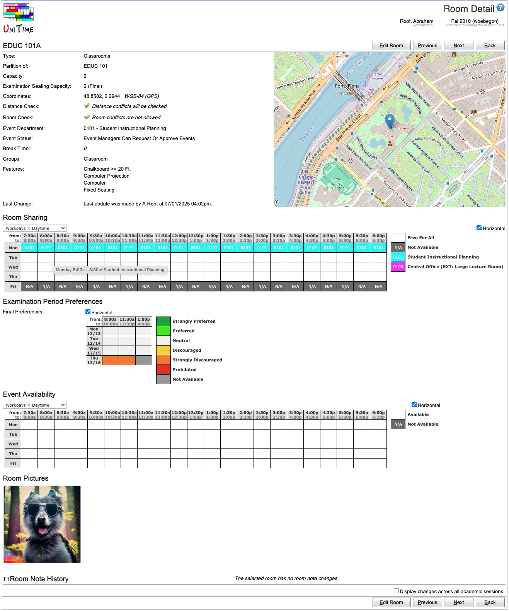

## Screen Description

 The Room Detail screen provides details about a particular room or non-university location.

## Details

 The top line consists of the room name and all the buttons described in the Operations section of this page.

* **Type**
	* Room type of this room (room types are defined in Administration → Other → [Room Types](room-types))
	* Can be changed in the [Edit Room](edit-room) screen

* **Display Name**
	* Display name of the room (if present)

* Can be changed in the [Edit Room](edit-room) screen

* **External Id**
	* External Id of the room
	* Can be changed in the [Edit Room](edit-room) screen

* **Capacity**
	* Seating capacity of the room (the maximum number of students who can have a class there at the same time)
	* For rooms on campus (not non-university locations), it has to match the room inventory; for some rooms (e.g., not Classrooms), you can request a change in capacity in the [Contact Us](http://help34.unitime.org/Contact_Us) screen (the category "Request any other administrative change" is best suitable).

* **Exam Seating Capacity**
	* Examination seating capacity is displayed if the room can be used for examinations (the capacity is the same for final and midterm examinations) - it can be different from the room capacity if e.g. students are required to use only every other seat during an examination

* **Controlling Department**
	* Department that controls room availability and room sharing for course timetabling (those can be changed in the [Edit Room Availability](edit-room-availability) screen)

* **Coordinates**
	* Location coordinates of the room on the campus map or GPS coordinates
	* The coordinates are used to calculate distances between rooms (to decide whether the students and instructors can reach that room from their previous location during the break)
	* Can be changed in the [Edit Room](edit-room) screen

* **Area**
	* Room area, if present.
	* By default it is the square footage of the room
	* The unit can be changed using the [Application Configuration](http://help41.unitime.org/Application_Configuration) screen

* **Distance Check**
	* By default checked, which means that the distance is checked between classes in this location and other classes (to see if students can manage to get from one class to another)
	* When unchecked, there is no distance conflict between following classes (e.g. one at this location, the other one e.g. on campus) and the classes can be taught by the same instructor
	* Can be changed in the [Edit Room](edit-room) screen

* **Room Check**
	* By default checked, meaning that there can be only one class in this room at a time
	* Can be changed by the schedule deputy only for Non-University locations, for other rooms it is an administrative change
	* Can be changed in the [Edit Room](edit-room) screen

* **Event Department**

* The department that manages events in this room
	* Can be changed in the [Edit Room](edit-room) screen

* **Event Status**

* The status of the room for event management
	* Can be changed in the [Edit Room](edit-room) screen

* **Preference**
	* Preference determines whether the room should be used more or less than other rooms
		* Prohibited room cannot be used (by the given department)
		* Strongly discouraged room can only be used by classes that require this room
		* The solver automatically tries to minimize the use of a room that is marked as discouraged
		* Other preferences are used as a default preference of the room
	* Displayed only if the preference is not neutral (which is the default)
	* Can be changed in the [Edit Room](edit-room) screen, in the Room Sharing section

* **Groups**
	* A list of groups to which this room belongs (for example, EDUC 101 belongs to the Classroom room group)
	* You can add/remove the room to/from a group in the [Edit Room](edit-room) screen
	* Read more about room groups in the description of the [Room Groups](room-groups) screen

* **Features**
	* Room features are features that are tracked in the room inventory
	* Departmental feature include the name of the department of the feature.
	* Features can be split by the feature type, see [Room Feature Types](room-feature-types) screen for more detauils

* **Note**
	* Room note
	* Can be edited in the [Edit Room](edit-room) screen

* **Room Availability**
	* A time grid displaying what departments are allowed to use the room at what times
	* White (Free For All) means that any time can be used by any department from the list of departments that is a part of the legend (if only your department is listed, then the room is available only for you at all times)
	* Gray (Not Available) means that the room is not available for timetabling
	* You can change the size of the grid in the drop down list on top - it can be Workdays x Daytime, All Week x All Times, etc.
	* You can change the display of the time grid to horizontal (Days x Times) by checking the Horizontal checkbox on the same line as the drop down with display options
	* You can change the default display of all time grids in the application in the [Manager Settings](manager-settings) screen (Preferences → Settings in the main menu)
	* Can be edited in the [Edit Room](edit-room) screen

* **Final Examination Period Preferences**
	* Period preferences for when the final examinations should or should not be held in this room
	* Displayed if this room can be used for final examinations
	* Visible by administrators and examination managers only
	* The final examination period preferences can be changed in the [Edit Room](edit-room) screen

* **Midterm Examination Period Preferences**
	* Period preferences for when the midterm examinations should or should not be held in this room
	* Displayed if room can be used for midterm examinations
	* Visible by administrators and examination managers only
	* The midterm examination period preferences can be changed in the [Edit Room](edit-room) screen

* **Room Event Availability**
	* A time grid displaying when the room is available for events (white - available, grey - not available)
	* You can change the size of the grid in the drop down list on top - it can be Workdays x Daytime, All Week x All Times, etc.
	* You can change the display of the time grid to horizontal (Days x Times) by checking the Horizontal checkbox on the same line as the drop down with display options
	* The grid can be changed in the Edit Room Event Availability screen

* **Last Change**
	* Information about last change of the room
	* Visible for administrators

* **Room Pictures**
	* Room pictures and other attachments (e.g., floor plans)

* **Room Note History**
	* A log of room notes
	* Visible for administrators

## Operations

* **Edit Room** (Alt+R)
	* Go to the [Edit Room](edit-room) screen to edit room properties such as capacity, ignore room check, etc.

* Based on the permissions only some rooms may be editable (e.g., schedule deputy can see this button only for non-university locations; for other rooms, this operation is available only to administrators) and only some of the information can be edited by the user (e.g., event manager cannot change room sharing).

* **Previous** (Alt+P)
	* Go to the Room Detail screen for the previous room

* **Next** (Alt+N)
	* Go to the Room Detail screen for the next room

* **Back** (Alt+B)
	* Go back to the previous screen

{:class='screenshot'}
