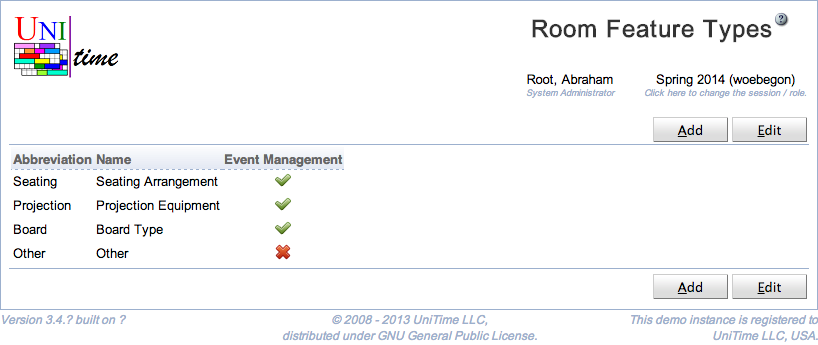
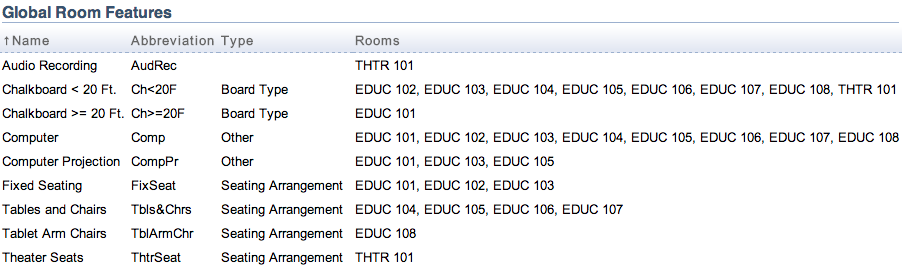
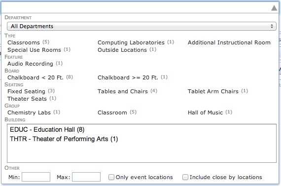
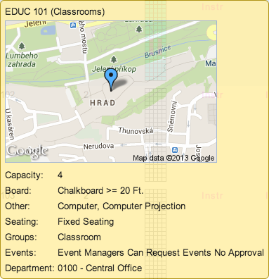
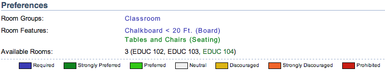

## Screen Description

 The Room Feature Types page can be used to categorize room features. Each room feature can have a room type (or no room type at all). Each room feature type has an abbreviation and a name. If the Event Management toggle is switched off, the room feature type and all its room features are not visible in the event management. This is useful for room features that are only important for course and examination timetabling.

 Room feature types are independent of academic sessions. The relation between room feature types and room features is included in the academic session roll forward of building and room data.

 The permission Room Feature Types is needed to be able to access the page, the permission Room Feature Type Edit is needed to be able to make changes. A room feature type can only be deleted when there are no room feature with that type. Both abbreviation and name are required and should be unique within the list of all room feature types.

## Details

 Once there are some room feature types defined, a room feature can have a type set on the [Edit Room Feature](edit-room-feature) page. The Type column will also appear on the [Room Features](room-features) page (once there is at least one room feature which has a room feature type defined).

{:class='screenshot'}

{:class='screenshot'}

 Room features are also grouped together by their type on various page. Here is an example from the [Rooms](rooms) page, the same grouping will appear on the [Class Assignment](class-assignment) and [Examination Assignment](examination-assignment) page. Note that the room features with no type will remain in the Room Features category.

{:class='screenshot'}

 The [Room Filter](events-room-filter) component (e.g., on the [Events](events)  pages) does group the room features by their type as well. Note that room feature types that have the event management unchecked do not show in the filter. Also, the room features with no type (if any) will remain in the FEATURE category.

{:class='screenshot'}

 Room feature types are also used in the room's tooltip.

{:class='screenshot'}

 And the room feature type does show in the brackets next to the feature name in preferences.

{:class='screenshot'}

## Operations

 To edit or delete an room feature type, click on the appropriate line, [Edit Room Feature Type](edit-room-feature-type) page will appear. All room feature types can be edited on the [Edit Room Feature Types](edit-room-feature-types) page. To do so, click on the **Edit** button.

 A new room feature type can be added on the [Edit Room Feature Types](edit-room-feature-types) page (button **Edit**) or using [Add Room Feature Type](add-room-feature-type) page (button **Add**).

 The table can be ordered by any of the columns. To do so, click on the column header and select Sort by <column name> option.
