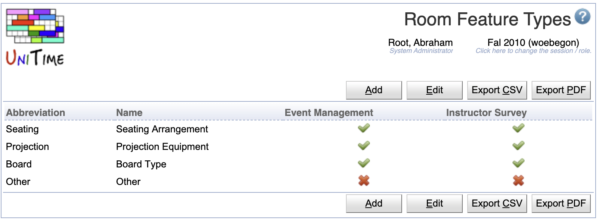

## Screen Description

The Room Feature Types page can be used to categorize room features. Each room feature type has an abbreviation and a name. If the **Event Management** toggle is switched off, the room feature type and all its room features are not visible in the [event management](events). This is useful for room features that are only important for course and examination timetabling.

Similarly, only room features of types with the **Instructor Survey** toggle switched on are available on the [Instructor Survey](instructor-survey) page that can be used to collect instructor preferences from individual instructors.

{:class='screenshot'}

Room feature types are independent of academic sessions. The relation between room feature types and room features is included in the academic session roll forward of building and room data.

The permission Room Feature Types is needed to be able to access the page, the permission Room Feature Type Edit is needed to be able to make changes. A room feature type can only be deleted when there are no room feature with that type. Both abbreviation and name are required and should be unique within the list of all room feature types.

## Details

Once there are some room feature types defined, a room feature can have a type set on the [Edit Room Feature](edit-room-feature) page. The Type column will also appear on the [Room Features](room-features) page (once there is at least one room feature which has a room feature type defined).

{:class='screenshot'}

Room features are also grouped together by their type on various pages, such as [Edit Room](edit-rooom). Note that the room features with no type will remain in the Room Features category.

The [Room Filter](events-room-filter) component (e.g., on the [Events](events)  pages) does group the room features by their type as well. Note that room feature types that have the event management unchecked do not show in the filter. Also, the room features with no type (if any) will remain in the FEATURE category.

{:class='screenshot'}

Room feature types are also used in the room's tooltip.

{:class='screenshot'}

And the room feature type does show in the brackets next to the feature name in preferences.

{:class='screenshot'}

## Operations

The table can be sorted by any of its columns, just by clicking on the column header and the sorting option that opens.

### Add Room Feature Type
Click **Add** to add a new room feature type

{:class='screenshot'}

* Click **Save** to create a new room feature type
* Click **Back** to return to the list without making any changes

### Edit Room Feature Type
Click a particular room feature type to make changes or to delete the room feature type

{:class='screenshot'}

* Click **Save** to make changes, **Back** to return to the list without making any changes
* Click **Previous** or **Next** to save the changes and go to the previous or next room feature type respectively
* Click **Delete** to delete the room feature type. Only room feature type that are not being used (do not have any room features) can be deleted.

### Edit Room Feature Types
Click **Edit** to edit all room feature types

{:class='screenshot'}

* Use the  icon to add a new line and  to delete a line
* Only room feature type that are not being used (do not have any room features) can be deleted
* Click **Save** to make changes, **Back** to return to the list without making any changes

### Export CSV/PDF
Click the **Export CSV** or **Export PDF** to export the list to a CSV or PDF document respectively
