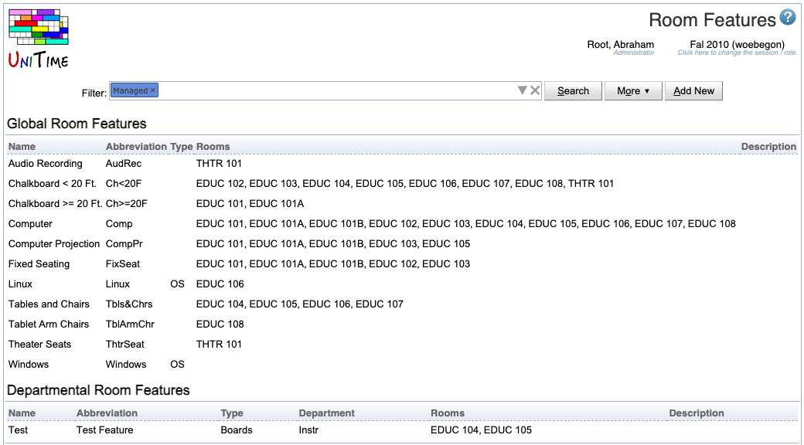

## Screen Description

{:class='screenshot'}

## Details

Select the department for which you want to display its room features in the **Filter**. The other parameters in the **Filter** are used to filter the list of rooms visible on the page.

The list of features is divided into two parts:

* **Global Room Features**
    * Features that are usually populated from the room inventory
    * This part can be edited by an administrator only
    * Only global features can be used for midterm/final examination rooms
    * To add a global room feature, click **Add New** button (admins only)

* **Department Room Features**
    * Features added by the departmental schedule managers for a given department
    * This part is displayed only if there are any features created by the manager
    * To add a department room feature, click **Add New** button
    * To add or remove departmental rooms that have this feature, click on the line with the feature, which takes you to the [Edit Room Feature](edit-room-feature) screen

## Operations

* **Search**
    * Refresh the list of room features after the **Filter** has been updated

* **More**
    * Additional filtering and sorting capabilities
    * Also includes the export to PDF and CSV formats

* **Add New**
    * Go to the [Add Room Feature](add-room-feature) screen to add a new room feature applicable only to the rooms of the department selected in the Room Features screen
