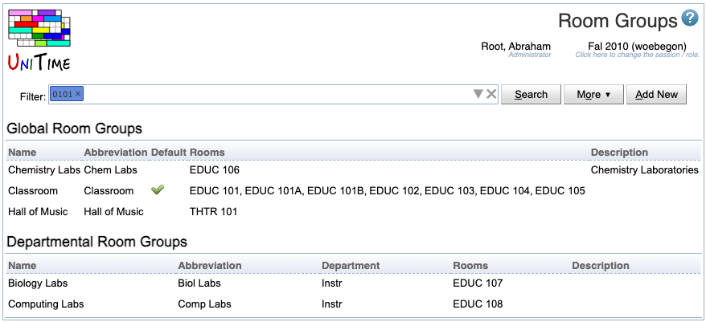

## Screen Description

In the Room Groups screen you have an overview of the groups of rooms applicable to the department selected in the upper part of the screen.

{:class='screenshot'}

## Details

Select the department for which you want to display its room features in the **Filter**. The other parameters in the **Filter** are used to filter the list of rooms visible on the page.

The list of groups is divided into two parts:

* **Global Room Groups**
	* Groups that are populated by administrators
	* This part can be edited by an administrator only
	* Only global room groups can be used for midterm/final examination rooms (when you select "All Midterm Examination Rooms" or "All Final Examination Rooms" in the Department drop down list)

* **Department Room Groups**
	* Groups added by the department schedule managers for a given department
	* This part is displayed only if there are any groups created by the deputy
	* To add a department room group, click Add New butoon
	* To add or remove departmental rooms that belong to this group click on the line with the group - that takes you to the [Edit Room Group](edit-room-group) screen

## Operations

* **Search**
    * Refresh the list of room groups after the **Filter** has been updated

* **More**
    * Additional filtering and sorting capabilities
    * Also includes the export to PDF and CSV formats

* **Add New**
	* Go to the [Add Room Group](add-room-group) screen to add a new room group applicable only to the rooms of the department selected in the Room Groups screen
