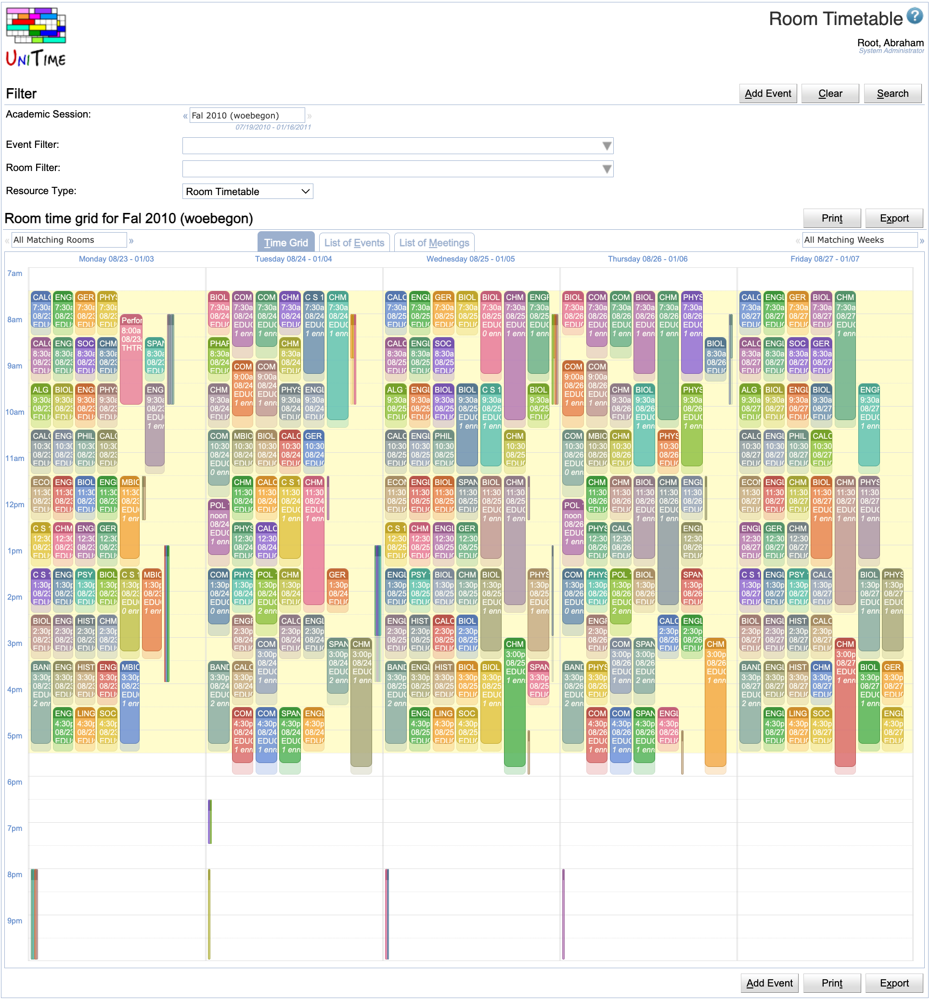

## Screen Description

 Room Timetable page is a variant of the [Events](events) page that allows to see a timetable of a particular room.

 Besides of the ability to filter events and rooms (see description of the [Event Filter](events-event-filter) and [Room Filter](events-room-filter)), the page allows to select a particular **resource type**. Besides of a Room Timetable (in which case the page works exactly like the [Events](events) page and a particular room can be selected in the [Room Filter](events-room-filter)) one of the following options can be selected:

* Subject Timetable (all class, examination, and course related events of a subject area or a course offering)

* Curriculum Timetable (all class, examination, and course related events of a curriculum)

* Departmental Timetable (all class, examination, and course related events of a department)

* Personal Timetable (all events of a person)

## Subject Timetable

 When the Resource Type it changed to Subject Timetable, one can see all class, examination, and course related events that are related to a particular subject area or a course offering. The subject area or course can be entered in the Subject field.

{:class='screenshot'}

{:class='screenshot'}

## Curriculum Timetable

 When the Resource Type is changed to Curriculum Timetable, one can see all class, examination, and course related events that are related to a particular curriculum. Either events for all classifications (years of study) or just one classifications can be displayed. This list can be filtered further using the [Event Filter](events-event-filter) and [Room Filter](events-room-filter).

 Please note that if a curriculum contains a course, all classes of the course will be displayed unless there is a matching curriculum reservation on the course.

{:class='screenshot'}

{:class='screenshot'}

## Departmental Timetable

 When the Resource Type is changed to Departmental Timetable, all one can see all class, examination, and course related events that are related to a particular department.

## Personal Timetable

 The page displays a personal timetable of the user. This includes all events requested by the user. For students, it also includes all classes and examinations he/she is enrolled and the related course related events. For instructors, it includes all classes and examinations they are assigned to.

 Users with Event Lookup Schedule permission can lookup a timetable of another person using the **Lookup** button.

 A useful feature is the ability to export the personal schedule as an iCalendar URL that can be inserted in your favorite calendar application and that always returns an up-to-date calendar for the selected academic session. To get the URL, select the Copy iCalendar URL option under the **Export** button. The following dialog appears and the url can be copied into the clipboard.

{:class='screenshot'}

{:class='screenshot'}
