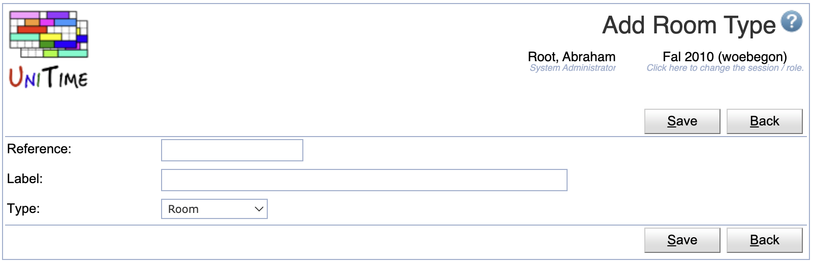
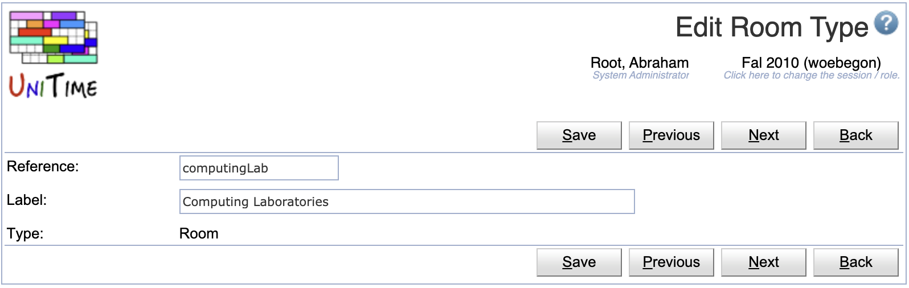
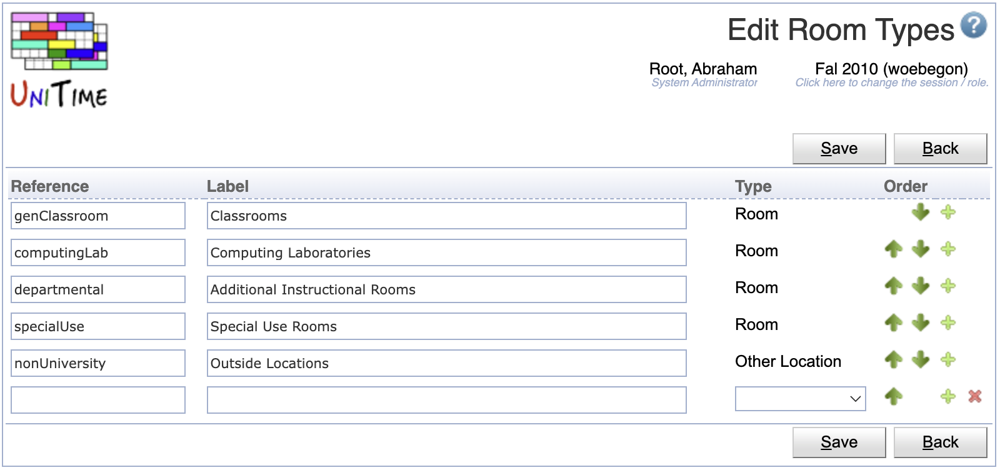

## Screen Description

The Room Types screen provides a list of available room types. Room types are used when it is needed to reduce possible rooms to a certain type, e.g. in event management where a user can ask e.g. for an available outside location or an available computing lab.

{:class='screenshot'}

## Details

* **Reference**
	* Name under which the room type is recognized internally by the application
	* It is used in XML import of buildings and rooms (`scheduledRoomType` attribute)

* **Label**
	* Room type label that is displayed in other screens throughout the application

* **Type**
	* Type of location (for example, Room or Other)
		* **Room** type is used for rooms in university space inventory (rooms within buildings)
		* **Other Location** type is used for non-university and/or outside locations (spaces without buildings)

* **Rooms**
	* Total number of different rooms in the current academic session that are of this type

## Operations

The table can be sorted by any of its columns, just by clicking on the column header and the sorting option that opens.

### Add Room Type
Click **Add** to add a new room type

{:class='screenshot'}

* Click **Save** to create a new room type
* Click **Back** to return to the list without making any changes

### Edit Room Type
Click a particular room type to make changes or to delete the room type

{:class='screenshot'}

* Click **Save** to make changes, **Back** to return to the list without making any changes
* Click **Previous** or **Next** to save the changes and go to the previous or next room type respectively
* Click **Delete** to delete the room type. Room types that are being used (there is at least one room of that type) cannot be deleted.

### Edit Room Types
Click **Edit** to edit all room types

{:class='screenshot'}

* Use the  and  arrows to move a line up and down
* Use the  icon to add a new line and  to delete a line
* Room types that are being used (there is at least one room of that type) cannot be deleted
* Click **Save** to make changes, **Back** to return to the list without making any changes

### Export CSV/PDF
Click the **Export CSV** or **Export PDF** to export the list of room types to a CSV or PDF document respectively
