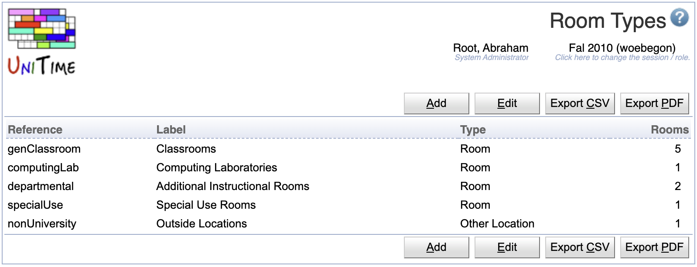

## Screen Description

 The Room Types screen provides a list of available room types. Room types are used when it is needed to reduce possible rooms to a certain type, e.g. in event management where a user can ask e.g. for an available outside location or an available computing lab.

## Details

* **Up** and **down** arrows
	* Change the order in which the room types are displayed in other screens (such as [Add Event](add-event) or [Rooms](rooms) screen)

* **Reference**
	* Name under which the room type is recognized internally by the application

* **Label**
	* Room type label that is displayed in other screens throughout the application

* **Type**
	* Type of location (for example, Room or Other)
		* Room type is used for rooms in university space inventory (rooms within buildings)
		* Other type is used for non-university and/or outside locations (spaces without buildings)

* **Rooms**
	* Total number of different rooms (with different permanent ID) in the application that are of this type

 Click on any room type in the list to get to its [Edit Room Type](edit-room-type) screen.

## Operations

* **Add Room Type** (Alt+A)
	* Go to the [Add Room Type](add-room-type) screen to add a new room type

{:class='screenshot'}
