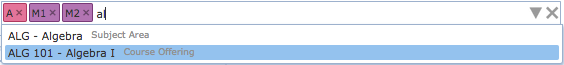
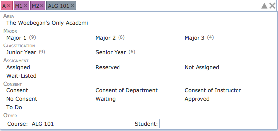

{:class='screenshot'}

## Description

The Scheduling dashboard filter is used on the [Online Student Scheduling Dashboard](online-student-scheduling-dashboard) and [Student Sectioning Dashboard](student-sectioning-dashboard) pages to control the search criteria used to display data on the page. It allows selection by the academic area, major, classification, student group, student status, subject area or course, student name, etc.

{:class='screenshot'}

While the scheduling dashboard filter appears as a single text input area, it has a lot of functionality.  Information can be entered as text using just the keyboard.  While typing, a list of matching suggestions is displayed below the box.  These suggestions include the matching courses or students, as well as other filtering options (e.g., an academic area that all the matching students must have).  Suggestions can be browsed using the Up and Down arrow keys.  A suggestion is selected by typing Enter or by clicking on a suggestion using the mouse.  If a suggestion is selected, it is put into the filter as a colored box (called a Chip) just before the text entry area.  This allows filtering data by several criteria at once.  For instance, in the right-hand side example, we are looking for all students of academic area A and major M1 or M2 that are enrolled or are requesting course ALG 101.  Some chips of the same type (e.g., major) can be combined together (meaning a student must be of one of the selected majors).  Some chips are allowed only one for each type (indicated by the color of the chip, e.g., selected student status).  A chip can be removed from the filter by hitting the little x at the right side of the colored box or by pressing Backspace at the beginning of the text area (i.e., when there is no character to remove).  All entered data can be removed from the filter by clicking the big X button  on the rightmost side of the filter box. The list of suggestions appears automatically as the text is being entered in the text field, or when Down arrow key is pressed at the end of the entered text.

The filter can be also used with a mouse. By clicking on the drop-down (triangle shaped) icon  on the right side of the box a window is opened displaying all of the options. This is a very useful feature for someone not very familiar with existing student statuses, academic areas, groups, etc.  The window is closed by clicking on the drop-down icon  for the second time (notice that it changes its orientation when the window is opened) or when the room filter component loses its focus (e.g., when clicked outside of the component or some other component is focused by pressing Tab key).  The list of available options is automatically updated based on the current content of the filter (e.g., only majors of the selected academic area are present in the popup).  The number in the brackets next to the option shows the number of students (out of the students already matching the filter) that match the option.  A selected chip can be also unselected by clicking on the appropriate option for the second time.  For instance, if the Major 2 major is selected, clicking on the Major 2 major for the second time will remove the Major 2 major from the filter (the M2 chip will disappear).Finally, the component also allows for boolean expressions. In these, most of the chips can be used as well, in the format type:value (see the mouseover tooltip on a chip to see how to enter it as a text).  For instance, the following query

{:class='screenshot'}

{:class='screenshot'}

returns all students that are of the A academic area and are enrolled in less than 10 credit hours or in 20 or more credit hours.

## Options

Besides a name or an external ID of a student, the scheduling dashboard filter allows for the following options:

* **Status:** scheduling status of a student. Please note that only statuses that are in use are shown in the popup.
* **Area**: academic area of a student
* **Major:** academic major of a student. Please note that the appropriate academic area must be selected first.
* **Classification**: academic classification code
* **Group**: student group
* **Accommodation**: student accommodation
* **Assignment:** filtering course requests that are assigned, not-assigned, reserved (assigned following a reservation), or wait-listed
* **Consent**: course requests that require a consent (any consent, consent of department, or consent of instructor) or no consent, that are waiting for consent, have the consent approved. The to-do option shows all requests that are waiting for consent that the user can approve.
* **Couse:** subject area or course
* **Student:** name or external ID of a student

## Additional Tags

The following tags can be used, but are not visible on the popup. Some of these are shown as suggestions, e.g., when a number is entered or a particular operation is entered.

* **credit:** - this tag allows the user to filter on the number of credits the students are registered for, e.g., credit:18..22` would return data for students who are registered for 18 through 22 credits.
* **overlap:** - this tag allows the user to filter on the amount of time the students have overlapping classes in their schedules, e.g., `overlap:>=30` would return students who have 30 or more minutes of overlapping classes.
* **time:** - this tag allows the user to filter on the start time of classes, e.g., `time:8:30pm` returns records for all students that have at least one class that begins at 8:30 pm.
* **room:** - this tag allows the user to filter on the building or room a class is in, e.g., `room:"CL50 224"` would return all records where there is a class a student is enrolled into that meets in the room CL50 224.  `room:CL50` would return all records where there is a class a student is enrolled into that meets in the building CL50.
* **limit:** - this allows the user to limit the number of records displayed to a maximum of the number specified, e.g., `limit:5` would limit the number of records displayed to 5.
* **operation:** - this is only valid for the **Change Log** tab.  It allows the user to filter data on the **Change Log** tab by operation; e.g., `operation:eligibility` retrieves only change log entries associated with eligibility checks.
* **result:** - this is only valid for the **Change Log** tab.  It allows the user to filter the data on the **Change Log** tab by result; e.g., `result:failure` retrieves only change log entries with a result of failure.
* **message:** - this is only valid for the **Change Log** tab.  It allows the user to filter the data on the **Change Log** tab by a substring of the message returned, e.g., `message:changed` would return any change log entries whose message contains the word changed.
* **over:** - this is only valid for the **Change Log** tab.  It allows the user to filter the data on the **Change Log** tab by the time, in seconds, the API call associated with the action in the change log took to complete; e.g., over:30 returns any actions that took over 30 seconds to complete.

In addition to the tags described above, it is also possible to use the following operations by typing into the filter:

* **and** - used to indicate the statements on each side of the “and” must be true, e.g., `credit:>=15 and overlap:>20` would return all records where students are enrolled in 15 or more credit hours and have more than 20 minutes of overlapping class time.  
* **or** - used to indicate that one of the statements on each side of the “or” must be true, e.g., `credit:<5 or credit:>18` would return records where students were either enrolled in less than 5 credit hours or more than 18 credit hours.
* **()** - used to group a set of “and” or “or” operations to create more complex queries, e.g., “(credit:<5 or credit:>18) and overlap:>10” would return records where students were enrolled in classes that overlapped for more than 10 minutes and were enrolled in either fewer than 5 credits or more than 18 credits.
* **>** - used with tags that take numbers.  This will return records with a value greater than the number that follows, e.g., `overlap:>5` would return all records where a student has enrolled in more than 5 minutes of overlapping classes.
* **>=** - used with tags that take numbers.  This will return records with a value greater than or equal to the number that follows, e.g., `overlap:>=5` would return all records where a student has enrolled in 5 or more minutes of overlapping classes.
* **<** - used with tags that take numbers.  This will return records with a value less than the number that follows, e.g., `credit:<5` would return all records where a student has enrolled in less than 5 credit hours.
* **<=** - used with tags that take numbers.  This will return records with a value less than or equal to the number that follows, e.g., `credit:<=5` would return all records where a student has enrolled 5 or fewer credit hours.
* **..** - used with tags that take numbers.  This allows the user to specify a range of values, e.g., `credit:15..20` would return students enrolled in from 15 through 20 credit hours.