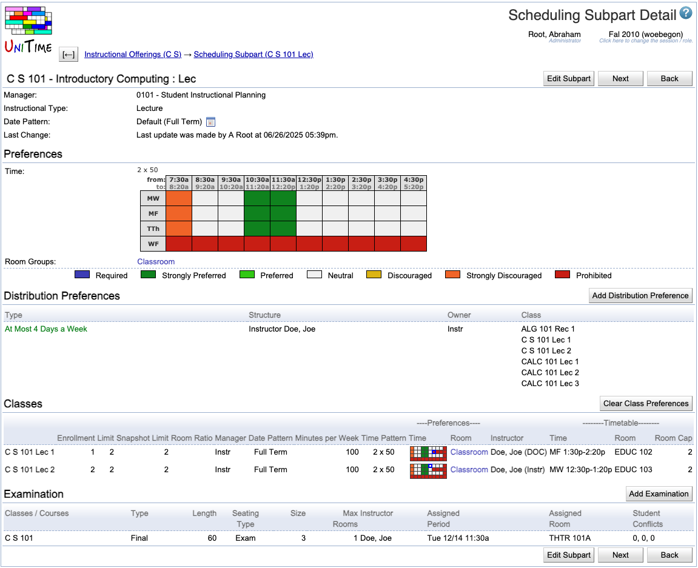

## Screen Description

The Scheduling Subpart Detail screen offers an overview of information about a scheduling subpart. Most of the information is editable in the [Edit Scheduling Subpart](edit-scheduling-subpart) screen.

{:class='screenshot'}

## Details

The following fields are displayed in the upper part of the screen (below the name of the scheduling subpart):

* **Manager**
    * Manager responsible for timetabling the classes of this scheduling subpart
    * Editable in the [Multiple Class Setup](multiple-class-setup) screen

* **Instructional Type**
    * The instructional type of the classes of this scheduling subpart (such as lecture, recitation, ...)
    * Editable in the [Edit Scheduling Subpart](edit-scheduling-subpart) screen

* **Date Pattern**
    * Weeks throughout the semester during which the classes of this scheduling subpart are taught
    * Editable in the [Edit Scheduling Subpart](edit-scheduling-subpart) screen

* **Subpart Credit**
    * Credit that is attributable to this subpart
    * Only editable when the subpart credit is enabled using the `tmtbl.subpart.credit.editable` property in the [Application Configuration](application-configuration).

* **Last Change**
    * Information about the last change made to the scheduling subpart (recorded automatically when the [Edit Scheduling Subpart](edit-scheduling-subpart) screen is updated)

### Preferences

* Any preferences that have been set up for this scheduling subpart (with color coding for preference levels)
    * A more detailed description of the preferences can be found in the help screen for the [Edit Scheduling Subpart](edit-scheduling-subpart) screen 

* To change the preferences, click on the Edit Subpart button to get to the [Edit Scheduling Subpart](edit-scheduling-subpart) screen

### Distribution Preferences
* The list of distribution preferences applicable to this scheduling subpart or some of its classes.
* Click on any line to open the [Edit Distribution Preference](edit-distribution-preference) page for any of the distributions.
    * [Instructor Detail](instructor-detail) page is opened when the distribution preference is set on an instructor.

There is one operation in the Distribution Preferences section:

* **Add Distribution Preference** (Alt+A)
    * Go to the [Distribution Preferences](distribution-preferences) screen to add a new distribution preference
        * The scheduling subpart will be pre-populated in that screen

### Classes

* A list of all the classes of the scheduling subpart
    * For an explanation of the column headings, please see the description of the filter in the [Instructional Offerings](instructional-offerings) screen

* Click on a line with a class to get to the [Class Detail](class-detail) screen for that class

There is one operation in the Classes section:

* **Clear Class Preferences**
    * Delete preferences on all classes of this scheduling subpart and apply the preferences of this scheduling subpart (in combination with the instructor's preferences, if applicable).

### Examinations

* A list of examinations associated with this scheduling subpart
    * For an explanation of the column headings, please see the description of the column headings in the [Examinations](examinations) screen
    * The column **Student Conflicts** contains numbers of "Direct", ">2 a day", and "Back-To-Back" conflicts

* Click on a line with an examination to get to its [Examination Detail](examination-detail) screen

There is one operation in the Examinations section:

* **Add Examination** (Alt+X)
    * Go to the [Add Examination](add-examination) screen to add a new examination with the scheduling subpart filled in already

## Operations

* **Edit Subpart** (Alt+E)
    * Go to the [Edit Scheduling Subpart](edit-scheduling-subpart) screen to edit properties and preferences for the scheduling subpart

* **Previous** (Alt+P)
    * Go to the Scheduling Subpart Detail screen for the previous scheduling subpart

* **Next** (Alt+N)
    * Go to the Scheduling Subpart Detail screen for the next scheduling subpart

* **Back** (Alt+B)
    * Go to the previous non-editable screen (from which you entered this one)
