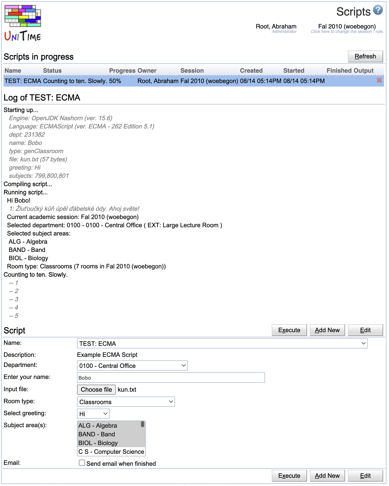

## Screen Description

The Scripts page allows to create a run pretty much any script within UniTime. A script can have many parameters, it can read or write a file, as well as change the database. The [JSR 223: Scripting for the Java Platform](http://docs.oracle.com/javase/6/docs/technotes/guides/scripting/) is used, so many scripting engines can be plugged in if needed. The JavaScript based [ECMAScript](https://en.wikipedia.org/wiki/ECMAScript) is available by default, [Jython](https://jython.readthedocs.io/en/latest/JythonAndJavaIntegration) has been tested as well.

{:class='screenshot'}

The creation of such scripts requires a working knowledge of the UniTime's source code and the Hibernate model. There is no comprehensive development documentation at the moment, except for the source code itself. The Hibernate model (i.e., the *.hbm.xml files in [JavaSource](https://github.com/UniTime/unitime/tree/master/JavaSource) folder) is a good place to start. Please contact us at [support@unitime.org](mailto:support@unitime.org) if you need a help with development of a particular script.

Users with Scripts permission can open the Scripts page, however, each script may require a particular permission for the user to be able to select and execute the script. To create, modify, or delete a script permission Script Edit is required.

**Note:** If you are using Java 15 or later, the ECMAScript engine may not be available by default. In this case, you need to install a JSR233 compatible JavaScript engine manually. The easiest is to use the standalone version of [Nashorn](https://github.com/openjdk/nashorn) (which used to be included in Java till version 14). To do so, download the following JARs and put them in Tomcat/lib folder. You will need to restart the Tomcat afterward.

* [nashorn-core-15.4.jar](https://repo1.maven.org/maven2/org/openjdk/nashorn/nashorn-core/15.4/nashorn-core-15.4.jar)
* [asm-9.7.1.jar](https://repo1.maven.org/maven2/org/ow2/asm/asm/9.7.1/asm-9.7.1.jar)
* [asm-commons-9.7.1.jar](https://repo1.maven.org/maven2/org/ow2/asm/asm-commons/9.7.1/asm-commons-9.7.1.jar)
* [asm-tree-9.7.1.jar](https://repo1.maven.org/maven2/org/ow2/asm/asm-tree/9.7.1/asm-tree-9.7.1.jar)
* [asm-util-9.7.1.jar](https://repo1.maven.org/maven2/org/ow2/asm/asm-util/9.7.1/asm-util-9.7.1.jar)
* [asm-analysis-9.7.1.jar](https://repo1.maven.org/maven2/org/ow2/asm/asm-analysis/9.7.1/asm-analysis-9.7.1.jar)

**Note:** Starting with UniTime 4.8.168, the above libraries are included in the UniTime distribution. If you are using this or a later version, there is no need to install Nashord separately.

## Details

To add a new script click on the **Add New** button. To edit an existing script, select the script in the drop down and click on **Edit** button. A script can be deleted from the Edit Script dialog, by clicking on the **Delete** button.


{:class='screenshot'}

A script has a name and a description. A particular engine has to be selected as well (the list of available scripting engines is in the Engine drop down). The Permission drop down allows to select a permission that the user must have to be able to execute the script (or to be even able to see it in the drop down of available scripts). A script can have one or more parameters. A parameter has a name (and it is referred by this name from the script), a label that is visible to the user, a type (various types are supported, see the example below) and it may have a default value.

## Example

Here is an example of what is possible to do with a script (using [ECMAScript](https://en.wikipedia.org/wiki/ECMAScript) engine). While the code looks like JavaScript it runs on the server and it can access parameters and all the UniTime classes.
```
// Logging
if (name != null) {
  log.info(greeting + ' ' + name + '!');
} else {
  log.info(greeting + '!');
  log.warn('No name was given.');
}
// Reading an input (text) file
if (file != null) {
  var lines = file.getString(java.nio.charset.Charset.forName("utf-8")).split('\n');
  for (var i = 0; i < lines.length; i++) {
    log.debug((1 + i) + ': ' + lines[i]);
  }
} else {
  log.error('No file to read.', null);
}
// Writing an output file
var file = log.createOutput('test', 'txt');
var out = new java.io.PrintWriter(new java.io.FileWriter(file));
out.println('This is a test.');
out.flush(); out.close();
// Special parameters
log.info('Current academic session: ' + session.getLabel());
if (dept != null) {
  log.info('Selected department: ' + dept.getDeptCode() + ' - ' + dept.getLabel());
}
if (subjects != null) {
  log.info('Selected subject areas:');
  for (var i = 0; i < subjects.size(); i++) {
    var subject = subjects.get(i);
    log.info('   ' + subject.getSubjectAreaAbbreviation() + ' - ' + subject.getTitle());
  }
}
if (type != null) {
  var t = hibSession.createQuery('from RoomType where reference = :reference').setParameter('reference', type).uniqueResult();
  log.info('Room type: ' + t.getLabel() + ' (' + t.countRooms(session.getUniqueId()) + ' rooms in ' + session.getLabel() + ')');
}
// Progress
log.setStatus('Counting to ten. Slowly.', 10);
for (var i = 0; i < 9; i++) {
  java.lang.Thread.sleep(i * 1000);
  log.incProgress();
  log.debug('-- ' + (1 + i));
}
```

It has the following parameters:

| **Name** | **Label** | **Type** | **Default** |
| dept | Depatment | department ||
| name | Enter your name | string ||
| file | Input file | file ||
| type | Room type | reference(RoomType) ||
| greetings | Select greeting | enum(Ahoj,Hello,Hola,Hi) | Hello |
| subjects | Subject area(s) | subjects ||

Besides of the parameters, it can access a hibernate session (parameter `hibSession` of `org.hibernate.Session` class), current academic session (parameter `session`, of [Session](https://github.com/UniTime/unitime/tree/master/JavaSource/org/unitime/timetable/model/Session.java) class) and the object running the script (parameter `log`, of [ScriptExecution](https://github.com/UniTime/unitime/tree/master/JavaSource/org/unitime/timetable/server/script/ScriptExecution.java) class). The hibernate session is opened with a transaction started. This transaction is committed when the script finishes fine, it is rollbacked otherwise. The log can be used to print debug, info, warn, and error message; to control script status and progress; and to create an output file.

The parameters can be of various types. Basic types are `string`, `boolean`, `int`, `long`, `double`, `float`, `short`, and `byte`. There can be a drop down selection of
* one or multiple departments (type `department` or `departments` of class [Department](https://github.com/UniTime/unitime/tree/master/JavaSource/org/unitime/timetable/model/Department.java) or `List<Department>`),
* one or multiple subject areas (type `subject` or `subjects` of class [SubjectArea](https://github.com/UniTime/unitime/tree/master/JavaSource/org/unitime/timetable/model/SubjectArea.java) or `List<SubjectArea>`),
* one or multiple buildings (type `building` or `buildings` of class [Building](https://github.com/UniTime/unitime/tree/master/JavaSource/org/unitime/timetable/model/Building.java) or `List<Building>`),
* one or more locations (type `location` or `locations` of class [Location](https://github.com/UniTime/unitime/tree/master/JavaSource/org/unitime/timetable/model/Location.java) or `List<Location>`),
* or one or more rooms (type `room` or `rooms` of class [Room](https://github.com/UniTime/unitime/tree/master/JavaSource/org/unitime/timetable/model/Room.java) or `List<Room>`).

It can also be an input file (type `file`). A selection of one of given strings (type `enum`) or a value from a reference table (type `reference(RefTableEntry)`, where `RefTableEntry` is a model class inherited from [RefTableEntry](https://github.com/UniTime/unitime/tree/master/JavaSource/org/unitime/timetable/model/RefTableEntry.java), the result is a string with the value of the reference column of the selected item) are also accepted.

If a user has a department dependent role (e.g., departmental schedule manager), only associated departments, subject areas, rooms, and buildings will be available in the drop downs.

## Python

To allow python scripting, the standalone jar version of Jython (e.g., [jython-standalone-2.7.4.jar](https://repo1.maven.org/maven2/org/python/jython-standalone/2.7.4/jython-standalone-2.7.4.jar), see [Jython downloads](https://www.jython.org/download.html)) needs to be put in Tomcat/libs folder. After Tomcat is restarted, python should appear as an available engine. Here is an example script (same as the one above) written using python:
```
# Logging
if name:
  print '%s %s!' % (greeting, name)
else:
  print '%s!' % greeting
  log.warn('No name was given.')
# Reading an input (text) file
if file:
  i = 1
  for line in file.getString().split('\n'):
    log.debug('%d: %s' % (i, line))
    i = i + 1
else:
  log.error('No file to read.', None)
# Writing an output file
f = open(log.createOutput('test','txt').getAbsolutePath(), 'w')
f.write('This is a test.\n')
f.close()
# Special parameters
print 'Current academic session: %s' % session.getLabel()
if dept:
  print 'Selected department: %s - %s' % (dept.getDeptCode(), dept.getLabel())
if subjects:
  for subject in subjects:
    print '   %s - %s' % (subject.getSubjectAreaAbbreviation(), subject.getTitle())
if type:
  t = hibSession.createQuery('from RoomType where reference = :reference').setParameter('reference', type).uniqueResult()
  print 'Room type: %s (%d rooms in %s)' % (t.getLabel(), t.countRooms(session.getUniqueId()), session.getLabel())
# Progress
log.setStatus('Counting to ten. Slowly.', 10)
from java.lang import Thread
for i in range(10):
  Thread.sleep(i * 1000)
  log.incProgress()
  log.debug('-- %d' % (1 + i))
```
