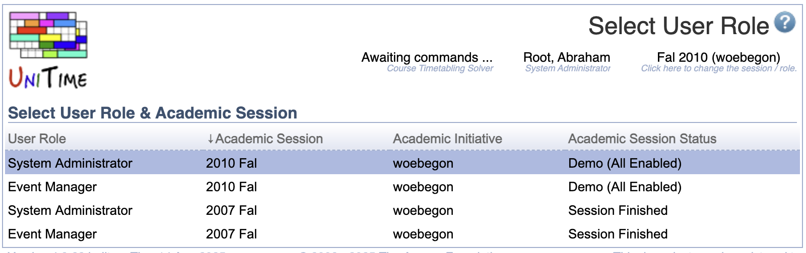

## Screen Description

 In Select User Role screen, select an academic session on which you want to work (for which you want to be able to access input data, solver, and, if administrator, all the administration pages) and the user role under which you want to work.

 This screen is also presented after log-in into the application, when there is no default academic session identified for the user with multiple roles, e.g., if there are multiple academic initiatives with sessions available.

## Details

 Each option has the following columns

* **User Role**
	* Role such as Administrator, Department Schedule Manager, etc.

* **Academic Session**
	* The session/term with which you want to work

* **Academic Initiative**
	* The institution/initiative on which you need to work (useful when the institution has multiple program initiatives requiring multiple independent timetables)

* **Academic Session Status**
	* Status of the academic session - see more in the [Academic Sessions](academic-sessions) screen

{:class='screenshot'}
