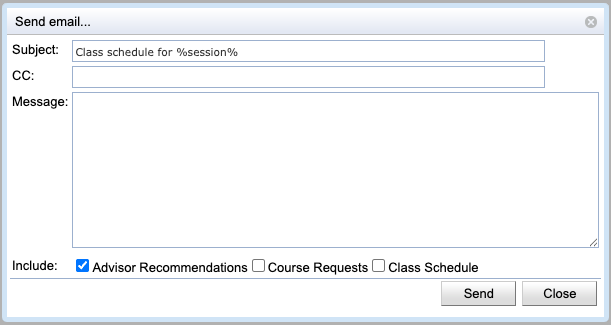

## Screen Description

The Send email... dialog provides interface for sending an email to one or more students during student scheduling.

{:class='screenshot'}

## Details

Note: The names of the students addressed by this email (selected in the previous screen) are not displayed in this screen.

* **Subject**
	* The Subject is pre-populated with "Class schedule for %session%", where "%session%" will be replaced with the name of the current session automatically

* **CC**
	* Place for additional email addresses, if copies should be sent to other recipients

* **Message**
	* Text of the email

* **Include**
	* Include [advisor course recommendations](advisor-course-recommendations), [student course requests](student-course-requests), and/or the [student class schedule](student-scheduling-assistant) in the email

## Operations

* **Send**
	* Send the email to recipients selected in the previous screen plus all the addressees from the CC line and go back to the previous screen

* **Close**
	* Close the pop-up window and go back to the previous screen without sending any email
