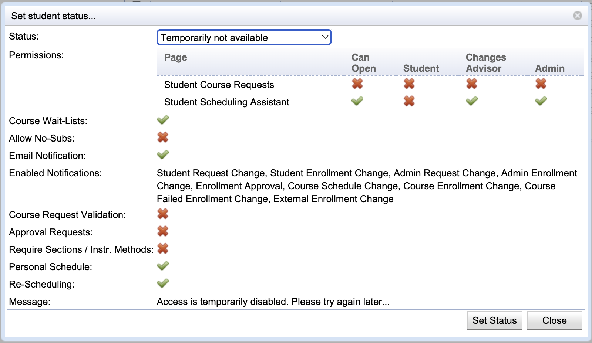

## Screen Description

The **Set student status...** for the selected student(s) dialog provides the ability to change status for one or more students in a way, where the user can see the properties of the new (selected) status.

{:class='screenshot'}

## Details

After a **Status** is selected, the rest of the dialog shows the properties of the selected status. Click **Set Status** to change the status for the selected student(s) or click **Close** to close the dialog without making any changes.

* **Permissions**
	* The first shows the permissions for the [Student Course Requests](student-course-requests) page, the second line for the [Student Scheduling Assistant](student-scheduling-assistant)
	* **Can Open**: The page can be opened (master switch)
	* **Student**: The student can make changes
	* **Advisor**: An advisor can make changes
	* **Admin**: An administrator can make changes
* **Course Wait-List**
	* Wait-listing is enabled for the student.
* **Allow No-Subs**
	* The student can indicate that the course cannot have any substitutes (when there are courses listed in the Substitute Course Requests table)
	* Typically, either Course Wait-List or Allow No-Subs are used, but not both at the same time
* **Emain Notification**
	* Email notifications are enabled
* **Enabled Notifications**
	* Lists the notification types enabled
* **Course Request Validation**
	* Enables the course request validation, when the custom course request validation is configured (i.e., the ability to check for registration errors and request overrides during pre-registration)
* **Approval Requests**
	* Enables the registration workflow, when the custom approval workflow is configured (i.e., the ability request overrides and other approvals during open registration)
* **Require Sections / Instr. Methods**
	* The student is allowed to require (not only prefer) individual sections and instructional methods
* **Personal Schedule**
	* The student can see their schedule on the [Personal Schedule](personal-schedule) page
* **Re-Scheduling**
	* The re-scheduling is enabled
	* That is for courses that allow for re-scheduling or wait-listing, automatically re-schedule students with a problem after a course change (while it is unlocked)
	* For example, if a class is cancelled the students in the cancelled class will automatically moved to an alternative class (of the same course) or dropped when there is no alternative class that fits their schedule. If wait-listing is enabled, the student is automatically put on a wait-list for the course in this case.
* **Effective Period**
    * Effective period for this status, when set
* **Fallback Status**
    * Student status that the selected status will fall back to outside the Effective Period
* **Message**
	* A message to be shown to the student when the open the [Student Course Requests](student-course-requests) or the [Student Scheduling Assistant](student-scheduling-assistant) page

Student statuses can be defined on the [Student Scheduling Status Types](student-scheduling-status-types) page in the Administration.