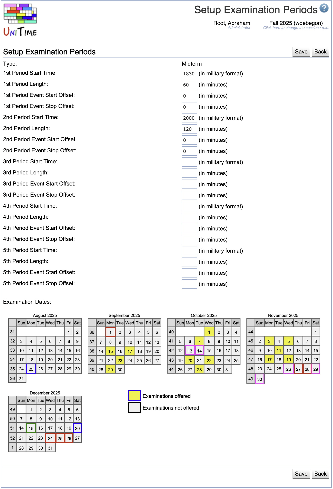

## Screen Description

 The Setup Examination Periods screen provides interface for setting up regular examination periods all at once (as opposed to one by one in the [Add Examination Period](add-examination-period) screen).

## Details

 In the first part of the screen, it is possible to set up up to five examination periods. Those periods will then be created for each of the dates indicated in the calendar in the second part. Only the periods that have their Start Time filled in will be created - the user can e.g. fill in data for two examination periods and leave the rest empty - then there will be two examination periods created for each date from the calendar.

* **Type**
	* Type of the examinations for which the periods are set up

* **1st Period Start Time**
	* The start time of the first examination period
	* If the start time is left empty, the examination period will not be created

* **1st Period Length**
	* The length of the first examination period

* **1st Period Event Start Offset**
	* For how many minutes before the examination should the room be available for students to enter and sit down, or to prepare the room (re-arrange chairs etc.)

* **1st Period Event Stop Offset**
	* How many minutes after the examination should the room be available for the students to leave the room or to return the room to the state where it was before the examination

* **Examination Dates**
	* To indicate dates on which the examinations should be held, click on the yellow rectangle ("Examinations offered") and then on the dates
	* To correct the dates and indicate that on some day there should be no examinations, click on the white rectangle ("Examinations not offered") and then on the dates when the examinations should not be offered
	* The calendar includes information about state and other holidays - the off days have red or pink borders in the calendar; the user can still set up examination periods for those days

## Operations

* **Save**
	* Save the examination periods and go back to the [Examination Periods](examination-periods) screen

* **Back**
	* Go back to the [Examination Periods](examination-periods) screen without saving any changes

## Notes

 To set up a single examination period that is different from the "regular" ones, go to the [Add Examination Period](add-examination-period) screen.

 To make changes to an individual examination period (after the general pattern is set up in this screen), click on the midterm examination period in the [Examination Periods](examination-periods) screen and make changes (such as changing time or preference) in its [Edit Examination Period](edit-examination-period) screen.

{:class='screenshot'}
