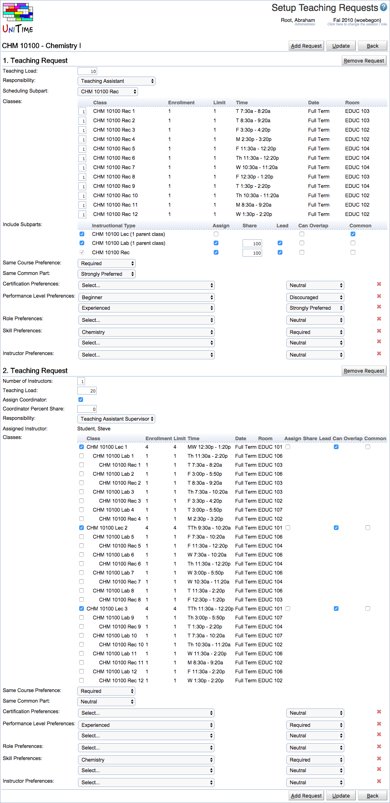

## Screen Description


 Instructors that are to be assigned automatically are not requested directly on classes, but there are teaching requests. Each teaching request may include multiple classes of the same course and provide some additional constraints.


 Each teaching request contains:

* **Number of Instructors**
	* 1 or more

* **Teaching Load**
	* in the number of units (could be hours)

* **Teaching Responsibility**
	* optional parameter, used in the class / coordinator assignment

* **Assign Coordinator**
	* boolean, with additional information for the assignment (percent share)

* **List of Classes**
	* with additional information
		* whether to assign the instructor (boolean)
		* if to be assigned: percent share, lead
		* can overlap (minimize overlapping time when allowed)
		* is common part (e.g., the lecture)

* **Preferences & Requirements**
	* attribute preferences, grouped by attribute types
	* instructor preferences

* **Same Course Preference**
	* should all the assignments of an instructor be for the same course, defaults to required

* **Same Common Preferences**
	* available when there are multiple common classes
	* should all the assignments of an instructor share the same common class, defaults to neutral


 The teaching requests are visible on the [Instructional Offering Detail](instructional-offering-detail) page (there is a new Teaching Requests section on the page), and can be setup using the Setup Teaching Requests page. The Setup Teaching Requests page can be reached by clicking the button of the same name in the Teaching Requests section of the Instructional Offering Detail page.

## Details


 To demonstrate how the teaching requests can be configured, let’s consider a course with 3 Lectures and 12 Labs and 12 Recitations in a parent-child relation as follows
```
Lec 1
    Lab 1
        Rec 1
    Lab 2
        Rec 2
    Lab 3
        Rec 3
    Lab 4
        Rec 4
Lec 2
    Lab 5
        Rec 5
    ...
    Lab 8
        Rec 8
Lec 3
    Lab 9
        Rec 9
    ...
    Lab 12
        Rec 12
```


 Now, imagine that we need two course coordinators (of the TA Supervisor responsibility) for the course that should be available during the lectures (the lectures can overlap with their unavailability, but we want to minimize the overlapping time). Next to that, we want a teaching assistant for each Lab - Rec pair. Each full-time teaching assistant (let’s consider a maximal load of 20 hours for a full-time TA) can teach two pairs, that should be of the same lecture. This means that a TA teaching Lab 1 - Rec 1 should rather teach Lab 3 - Rec 3 than for instance Lab 3 - Rec 5 combination as the later has a different lecture. The TA needs to be fully available during the lecture as well as during the labs and recitations he/she is teaching. All instructors must have the Chemistry skill and the coordinators must have more experience. We can also require that a TA cannot have teaching assignments of different courses. This can be configured using the Setup Teaching Requests as shown on the screenshot (the upper part).


 All the individual teaching assistant assignments are configured in the first table (1. Teaching Request). Each teaching request has a teaching load of 10 units (hours). The requests are configured for the Recitation subpart, and there is one instructor required for each recitation (table Classes). With the recitation, the instructor is also assigned to the appropriate Laboratory and he/she needs to be available during the Lecture. This is configured in the Include Subparts table. For each class (following the parent - child relation), there is information on whether the person is to be assigned to the class as an instructor (Assign column), and if so, what are the percent share and lead attribute. Can Overlap column indicate whether the instructor must be available during the time of the class or whether the overlapping time is to be minimized. The Common column defines which is the common part of the assignment (an instructor can teach two Lab - Rec pairs of the same lecture because they share the same common). The same course and same common preferences are indicated below the Include Subparts table. This is followed by attribute and instructor preferences. These are the same for all 12 Lab - Rec teaching requests. It is possible to indicate different preferences / requirements by splitting the teaching requests into multiple tables.


 The course coordinators are configured in the second part of the page, 2. Teaching Request table. There can be as many teaching request tables as needed (a new one can be added by clicking the Add Request button or the existing one can be deleted by clicking the Remove Request button). Here, we require two full-time instructors that should be available during all three lectures

## Operations

* **Add Request**
	* Add another request table at the bottom of the page

* **Remove Request**
	* Remove the request table

* **Update**
	* Update teaching requests and get back to the [Instructor Offering Detail](instructional-offering-detail) page

* **Back**
	* Get back to the [Instructor Offering Detail](instructional-offering-detail) page without making any changes

## Notes


 The created teaching requests are visible in the Teaching Requests section of the [Instructor Offering Detail](instructional-offering-detail) page and can be edited by clicking the Setup Teaching Requests button again.


 Once the solver has run, the table also shows the current instructor assignments, together with their details (instructor external id, name, assigned / maximal teaching load, attributes, time, course, and distribution preferences). Teaching Request Detail dialog is shown when a teaching request is clicked that allows to see more details and to make an assignment change with or without the solver loaded in memory (see the Solver chapter below for more details).


{:class='screenshot'}
