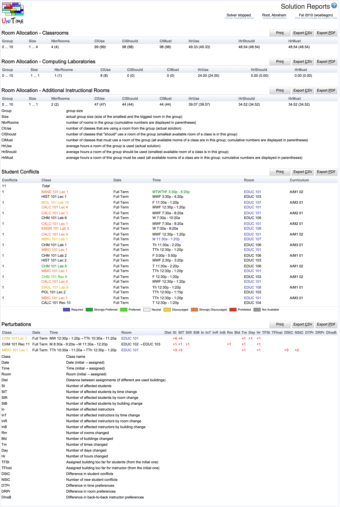

## Screen Description

The Solution Reports screen provides the user with information about the properties of the timetable such as room usage or student conflicts (see the details below).

{:class='screenshot'}

## Details

The screen is divided into sections based on particular solution properties. If a property is not applicable, the appropriate section is not displayed (for example, balancing is turned off for departmental timetabling, so it is not displayed for a departmental schedule manager).

### Room Allocation

Statistics about usage of rooms. The report is divided by the type of rooms. For each type, the next division is by room capacity. The elements of the statistics are described right below the table in the Solution Reports screen.

### Violated Distribution Preferences

A list of distribution preferences that have been violated. For example, if your strongly preferred distribution preference for Back-To-Back between class A and class B has been violated, you can be sure that these classes are not back to back in the current timetable.

### Instructor Back-To-Back Preferences

Information about instructors whose back-to-back classes are far away from each other – so far away that such assignment of rooms is discouraged or strongly discouraged by the solver.

### Student Conflicts

This is a complete list of student conflicts (their total is the number you can see in the [Solver](solver) screen). The number in the first column tells you how many students wanted to take both of the classes in the second column during that semester. If the number of conflicts for two classes is too high, you may want to change the assigned time (or room) in the timetable. There are four types of conflicts (a conflict can be of more than one type):

* Hard: It is not possible for students to be scheduled in an alternative class (for example, an alternative laboratory of the same course)

* Distance: The classes are taught in locations that are too far away from each other (the distance is listed when a distance conflict is present)

* Fixed: Both classes have only one possible time/room, they cannot be moved

* Committed: A conflict occurred with a class of a different problem that has been committed

### Departmental Balancing

Distribution of classes for each department throughout times of day. For each department, the maximum number of classes is calculated that should be taught at the same time (irrelevant of day of the week). Then for each department and each half-hour, there are two numbers - the first one indicates the number of classes taught at that half-hour (irrelevant of day of week - a class that is taught twice a week counts as two) and the second one the maximum number of classes that can be taught at a time. If the maximum is exceeded, the department gets a penalty (+1 for each class-half hour in excess). The total penalty is displayed in the second column of the report (nothing means no penalty; penalty is in red numbers).

The goal of departmental balancing is to have fair distribution - no department should have all classes around noon while another one has classes mainly early in the morning. Departmental balancing can be turned on or off for a solver configuration in the [Solver Configurations](solver-configurations) screen.

### Perturbations

A list of changes and related penalties (when looking for a timetable as close to the initial one as possible).

## Operations

* **Export PDF**
	* Export Reports to a PDF document

* **Refresh**
	* Refresh the screen
