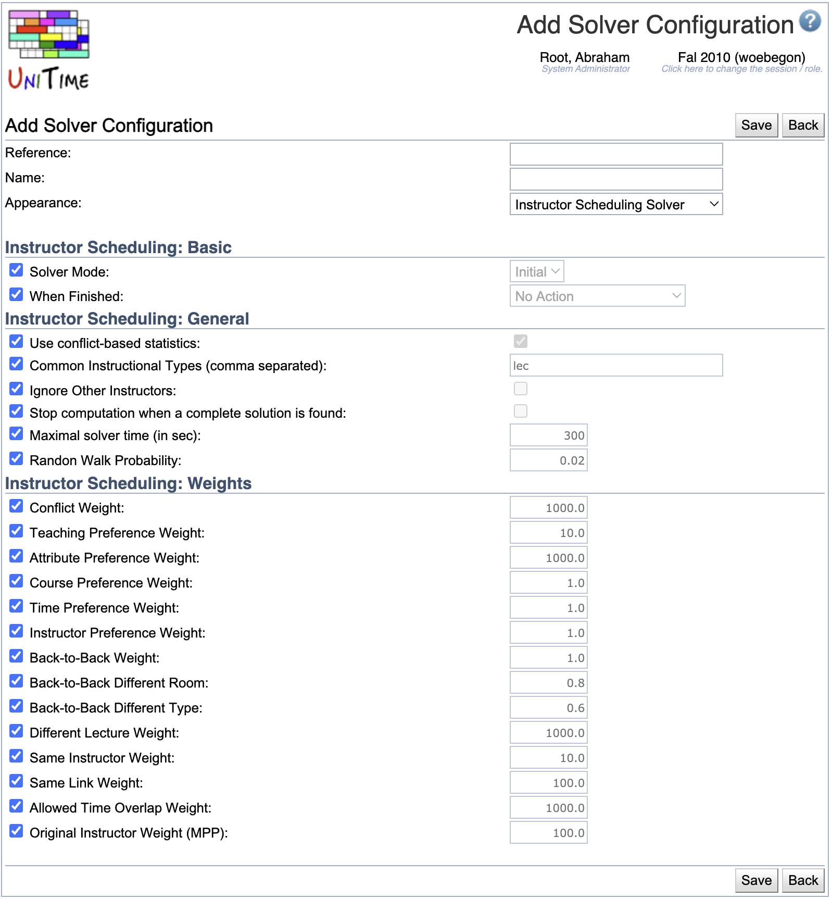

## Screen Description

The Solver Configurations screen provides a list of solver configurations that are currently available. See the Notes section below for some examples.

{:class='screenshot'}

## Details

* **Reference**
    * Unique name of the configuration

* **Name**
    * Name of the configuration that is displayed on the screen where the configuration is used

* **Appearance**
    * Name of the screen on which the configuration can be used, these include the following:
    * **Course Timetabling Solver** for the course timetabling solver configurations to be used on the [Course Timetabling Solver](course-timetabling-solver) page
    * **Courses Saved Timetables** for the interactive course timetabling solver configurations to be used on the [Saved Timetables](saved-timetables) page
    * **Examination Timetabling Solver** for the examination timetabling solver configurations to be used on the [Examination Solver](examination-solver) page
    * **Instructor Scheduling Solver** for the instructor scheduling solver configurations to be used on the [Instructor Scheduling Solver](instructor-scheduling-solver) page
    * **Student Scheduling Solver** for the student scheduling solver configurations to be used on the [Student Scheduling Solver](student-scheduling-solver) page

## Notes

As an example, here is a brief description of three solver configurations present in the [online demo](https://demo.unitime.org) for course timetabling:

* **Check**
    * Purpose: Check if input data is consistent and whether there is a complete (feasible) timetable consistent with the input data
    * The solver does not optimize the solution
        * Solution Comparator Weights are all set to 0
        * Placement Selection has most optimization parameters set to 0
        * The solver stops when a complete solution is found

* **Default**
    * Purpose: Create an optimized timetable consistent with the input data
        * Most parameters have their default values

* **Interactive**
    * Purpose: Create a timetable manually and/or make changes to an existing timetable that do not need to be consistent with the input data
        * It is allowed to break hard constraints (such as required/prohibited times/rooms)
        * The distribution preference "Different Time" is used for classes of the same instructional offering (such as lecture & lab that go together) instead of "Same Students". This makes it possible, e.g., to place a lecture in a place far away from the lab, which would not be possible with the "Same Students" constraint.

## Operations

Click on the column name to sort the table by that column. The second click on the same column will reverse the order.

### Edit Solver Configuration

Click on any solver configuration to make changes to an existing configuration or to delete it. The Edit Solver Configuration screen will also provide you with a lot more information about a given configuration than what can be seen in the list.

{:class='screenshot'}

**Note:** Changes to solver parameters can dramatically change the behavior of the solver; therefore, it is not recommended to make changes unless you know very well what you are doing.

The first part of the page allows you to change the **Reference**, **Name**, and **Appearance** of the configuration. Changing the appearance will update the list of parameters as only visible parameters from the solver parameter groups for the matching solver type are displayed. See [Solver Parameter Groups](solver-parameter-groups) and [Solver Parameters](solver-parameters) pages for more details.

The rest of the screen contains solver parameters organized by their group. When the checkbox to the left of the parameter is checked, the default value is used for the parameter. To change the default value, first uncheck the checkbox in front of the parameter name and then change the value at the end of the line.

#### Operations

* Click **Update** (ALT+U) to save changes and go back to the list of the existing solver configurations.
* Click **Delete** (ALT+D) to delete this configuration
* Click **Export** (ALT+E) to export the configuration into a text file ([Java properties format](https://en.wikipedia.org/wiki/.properties) that can be used by the solver when it is run from a command-line)
* Click **Back** (ALT+B) to go back to the list of the existing solver configurations without making any changes

### Add Solver Configuration

Click **Add Solver Configuration** (Alt+A) to create a new solver configuration.

{:class='screenshot'}

The first part of the page allows you to set the **Reference**, **Name**, and **Appearance** of the configuration. Changing the appearance will update the list of parameters as only visible parameters from the solver parameter groups for the matching solver type are displayed. See [Solver Parameter Groups](solver-parameter-groups) and [Solver Parameters](solver-parameters) pages for more details.

The rest of the screen contains solver parameters organized by their group. When the checkbox to the left of the parameter is checked, the default value is used for the parameter. To change the default value, first uncheck the checkbox in front of the parameter name and then change the value at the end of the line.

#### Operations
* Click **Save** (ALT+S) to save the new solver configuration and go back to the list of the existing solver configurations
* Click **Back** (ALT+B) to go back to the list of the existing solver configurations without making any changes
