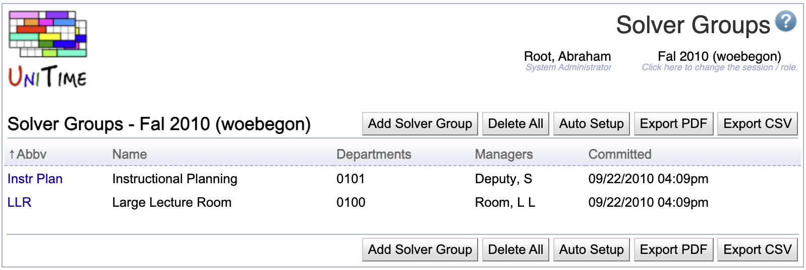

## Screen Description

 The Solver Groups screen provides a list of solver groups for the current academic session.

 A solver group is a group of departments and managers where each of the managers can create (and commit) a timetable for all the given departments together. A department can only be in one solver group, but a manager can be a part of more than one solver group.

## Details

* **Abbreviation** (Abbv)
	* Solver group abbreviation (displayed e.g. in the [Timetables](timetables) screen)

* **Name**
	* Name of the solver group

* **Departments**
	* Department numbers of the departments included in the solver group

* **Managers**
	* Schedule managers who are allowed to create timetables for the solver group

* **Committed**
	* Date and time when a timetable was committed for the solver group

 Click on any solver group to edit it in the [Edit Solver Group](edit-solver-group) screen.

## Operations

* **Add New**
	* Add a new solver group in the [Add Solver Group](add-solver-group)

* **Delete All**
	* Delete all existing solver groups for this academic session

* **Auto Setup**
	* Automatically set up solver groups based on the list of managers (in the [Timetable Managers](timetable-managers) screen)
		* Most of the departments form unique solver groups (a solver group is created for each of them)
		* If there are a few departments with exactly the same managers, those departments will be placed in one solver group (with their managers)

* **Export PDF**
	* Export the list of solver groups into a PDF document

{:class='screenshot'}
