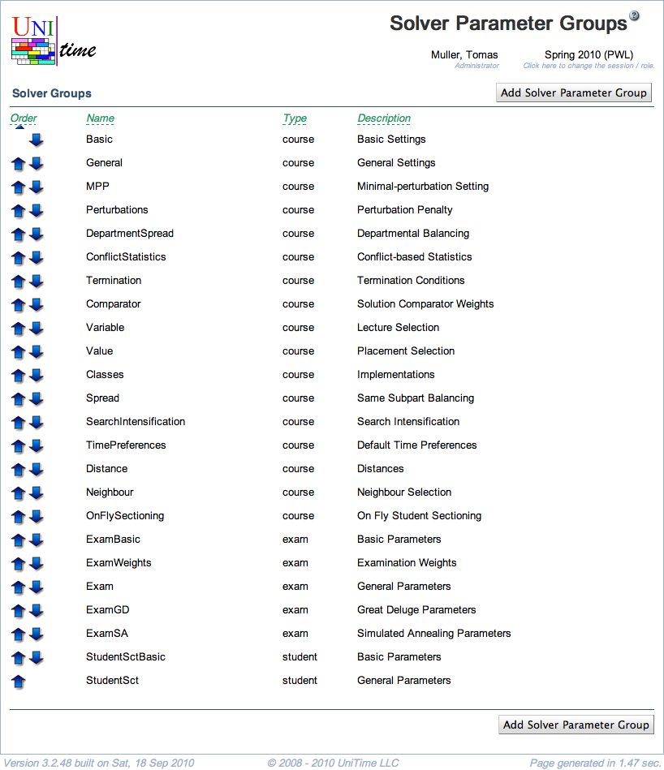

## Screen Description

 The Solver Parameter Groups screen provides a list of groups of solver parameters. These groups help organize the parameters in the [Solver Parameters](solver-parameters) or [Add Solver Configuration](add-solver-configuration) screens.

 The group Basic has a special function - the values of the parameters in this group can be changed in the [Solver](solver) screen by schedule managers before running the solver.

 **Note:** Changes to solver parameters can dramatically change the behavior of the solver, therefore it is not recommended to make changes unless you know very well what you are doing.

## Details

* **Order**
	* The **up** and **down** arrows can be clicked to change the order in which the groups appear in other screens

* **Name**
	* Name of the group

* **Description**
	* Description of the group (indicates what type of parameters are in the group)

 Click on any line to go to the [Edit Solver Parameter Group](edit-solver-parameter-group) screen.

## Operations

* **Add Solver Parameter Group**
	* Add a new solver parameter group in the [Add Solver Parameter Group](add-solver-parameter-group) screen

{:class='screenshot'}
