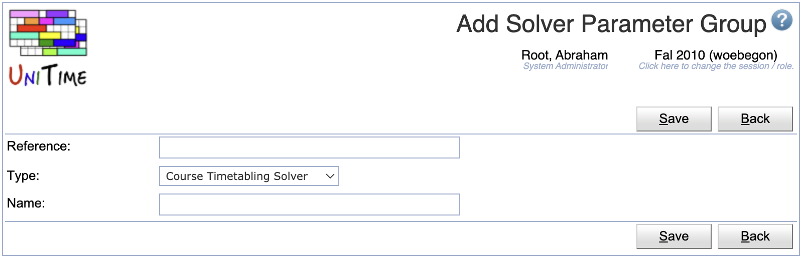
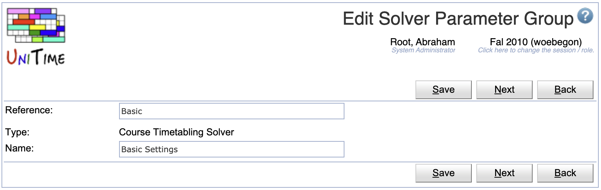
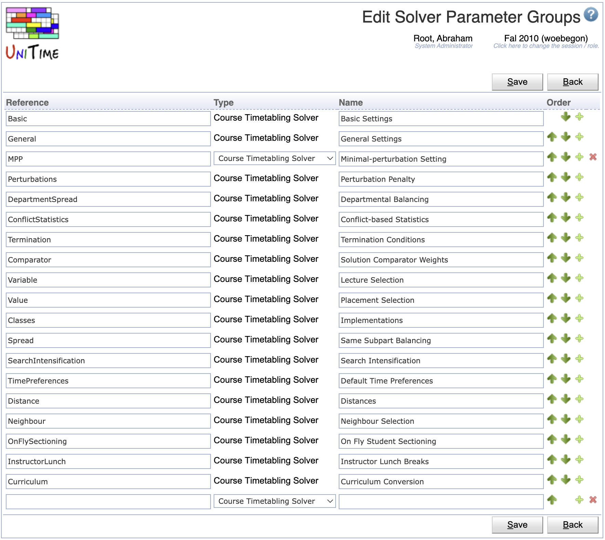

## Screen Description

The Solver Parameter Groups screen provides a list of groups of solver parameters. These groups help organize the parameters in the [Solver Parameters](solver-parameters) or [Solver Configurations](solver-configurations) screens.

{:class='screenshot'}

The group Basic has a special function - the values of the parameters in this group can be changed in the [Solver](solver) screen by schedule managers before running the solver.

**Note:** Changes to solver parameters can dramatically change the behavior of the solver, therefore it is not recommended to make changes unless you know very well what you are doing.

## Details

Each solver parameter group has the following properties:

* **Reference**
	* Reference of the parameter group
	* **Important:** Do not change for the Basic group

* **Type**
	* Solver type
	* Only solver parameter groups that have no parameters can have their type changed

* **Name**
	* Name of the group (indicates what type of parameters are in the group)

## Operations

The page can be filtered by the solver type. There are different parameters and parameter groups for each solver. Click **Search** to populate the page based on the selected type.

### Add Solver Parameter Group
Click **Add** to add a new solver group

{:class='screenshot'}

* Click **Save** to create a new solver parameter group
* Click **Back** to return to the list without making any changes

### Edit Solver Parameter Group
Click a particular solver parameter group to make changes or to delete the solver group

{:class='screenshot'}

* Click **Save** to make changes, **Back** to return to the list without making any changes
* Click **Previous** or **Next** to save the changes and go to the previous or next solver parameter group respectively
* Click **Delete** to delete the solver parameter group. Only solver parameter groups that have no solver parameters can be deleted.

### Edit Solver Parameter Groups
Click **Edit** to edit all solver parameter groups or change their order which is used in the display on the [Solver Parameters](solver-parameters) and [Solver Configurations](solver-configurations).

{:class='screenshot'}

* Use the  and  arrows to move a line up and down
* Use the  icon to add a new line and  to delete a line
* Only solver parameter groups that have no solver parameters can be deleted
* Click **Save** to make changes, **Back** to return to the list without making any changes

### Export CSV/PDF
Click the **Export CSV** or **Export PDF** to export the list to a CSV or PDF document respectively
