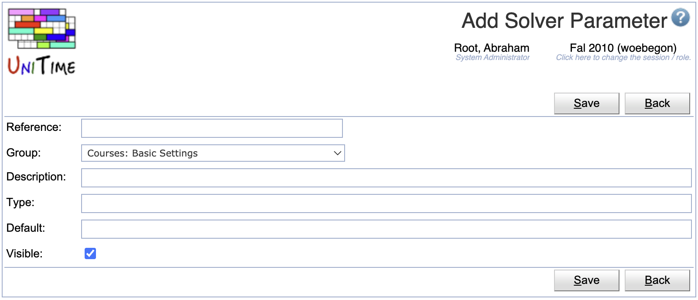
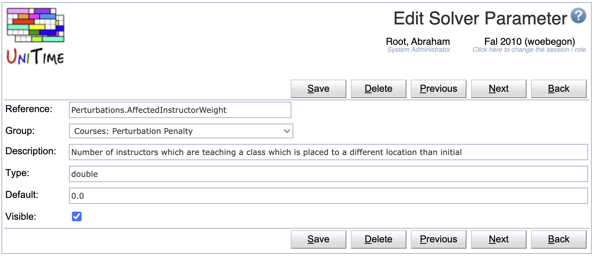
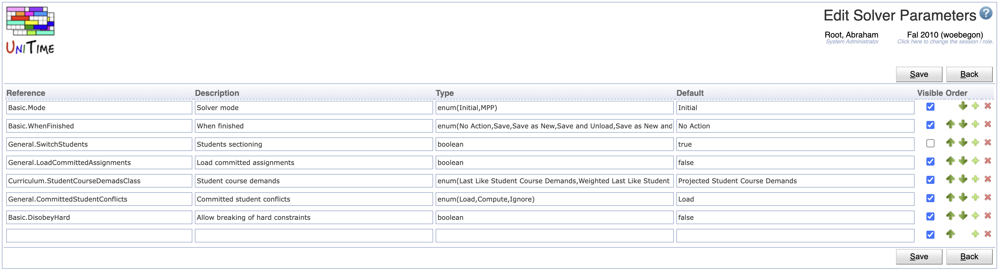

## Screen Description

The Solver Parameters screen provides a list of parameters together with their properties. The parameters are organized into groups defined in the [Solver Parameter Groups](solver-parameter-groups) screen.

{:class='screenshot'}

The values of the parameters in the Basic Settings can be changed by any user just before running the solver in the [Solver](solver) screen. The values of other parameters can be changed by administrator in [Solver Configurations](solver-configurations).

**Note:** Changes to solver parameters can dramatically change the behavior of the solver, therefore it is not recommended to make changes unless you know very well what you are doing.

## Details

Each solver parameter group has the following properties:

* **Reference**
	* Parameter reference
	* This is the name needed by the solver, **do not change**

* **Description**
	* Description of the parameter as displayed in the [Solver Configuration](solver-configurations)

* **Type**
	* Type of the parameter (text, boolean, double, integer, or enum)
	* The type is used on the [Solver Configurations](solver-configurations) to display a text field, a checkbox, or a drop-down.

* **Default**
	* Default value of the parameter

* **Visible**
	* Whether the solver parameter is visible in the [Solver Configuration](solver-configurations)

## Operations

The page can be filtered by the solver parameter group. Click **Search** to populate the page based on the selected parameter group.

### Add Solver Parameter
Click **Add** to add a new solver parameter

{:class='screenshot'}

* Click **Save** to create a new solver parameter
* Click **Back** to return to the list without making any changes

### Edit Solver Parameter
Click a particular solver parameter to make changes or to delete the solver parameter

{:class='screenshot'}

* Click **Save** to make changes, **Back** to return to the list without making any changes
* Click **Previous** or **Next** to save the changes and go to the previous or next solver parameter respectively
* Click **Delete** to delete the solver parameter

### Edit Solver Parameters
Click **Edit** to edit all solver parameters or change their order which is used on the [Solver Configurations](solver-configurations) page.

{:class='screenshot'}

* Use the  and  arrows to move a line up and down
* Use the  icon to add a new line and  to delete a line
* Click **Save** to make changes, **Back** to return to the list without making any changes

### Export CSV/PDF
Click the **Export CSV** or **Export PDF** to export the list to a CSV or PDF document respectively
