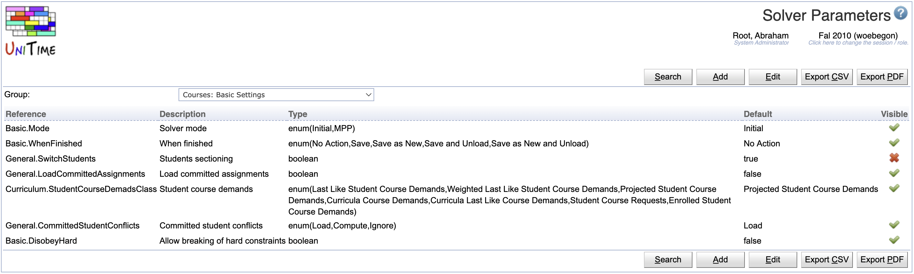

## Screen Description

 The Solver Parameters screen provides a list of parameters together with their properties. The parameters are organized into groups defined in the [Solver Parameter Groups](solver-parameter-groups) screen.

 The values of the parameters in the Basic Settings can be changed by any user just before running the solver in the [Solver](solver) screen. The values of other parameters can be changed by administrator only e.g. in [Solver Configurations](solver-configurations).

 **Note:** Changes to solver parameters can dramatically change the behavior of the solver, therefore it is not recommended to make changes unless you know very well what you are doing.

## Details

* **Order**
	* Click the **up** and **down** arrows to change the order of parameters as they are displayed in the [Add Solver Configuration](add-solver-configuration) or [Edit Solver Configuration](edit-solver-configuration) screen

* **Name**
	* Unique name of the parameter (the first part consists of the solver parameter group the parameter belongs to)

* **Description**
	* Description of the parameter as displayed e.g. in the [Add Solver Configuration](add-solver-configuration) screen

* **Type**
	* Type of the parameter

* **Default**
	* Default value of the parameter

 Click on any solver parameter to go to its [Edit Solver Parameter](edit-solver-parameter) screen.

## Operations

* **Add Solver Parameter**
	* Add a new solver parameter for a given group in the [Add Solver Parameter](add-solver-parameter) screen
		* Note: any parameter should be implemented and recognized by the solver before it is added here

{:class='screenshot'}

