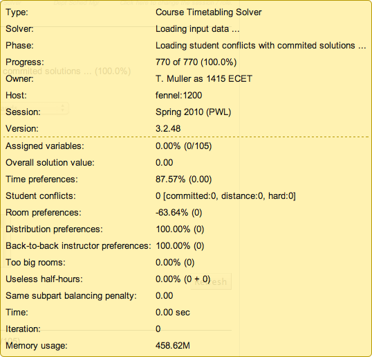

## Description

 The Solver Status section is displayed in the lower left hand side corner of the screen (below the menu) when solver is being used (otherwise it is a shaded tab next to the [Current User](current-user)).

## Details

* **Owner**
	* The user who is currently logged on + "as" + the solver group for which the user is creating a timetable

* **Host**
	* The server on which the solver is running (for this user & solver group - it can be different every time you load a timetable)

* **Solver**
	* Information about what the solver is doing
	* Examples:
		* Loading input data...
		* Awaiting commands...
			* This one means that the solver is waiting for your action, such as clicking on the Refresh button and then on Start to start creating a timetable or looking at the timetable or clicking on Unload etc.
		* Solving problem...
		* Solver stopped
		* Saving solution...

* **Phase**
	* The current phase of the solver
	* Examples:
		* Searching for initial solution
			* Searches for a complete timetable
		* Fixing solution
			* Looks for available times/rooms for classes; for possible assignments which could improve the complete timetable without switching with another class
		* Improving found solution
			* Looks for opportunities to improve the complete timetable even if it involves switching classes

* **Progress**
	* Just something to let you know that the solver is not dead

* **Version**
	* Current version of the application

 You can click on the Solver Status tab any time to refresh it. Otherwise it is refreshed automatically in regular intervals (such as every 10 seconds).

{:class='screenshot'}
