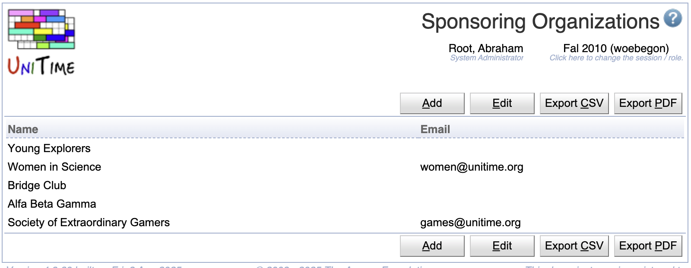

## Screen Description

A list of sponsoring organizations that is used for event management.

## Details

There is a name and email address (if available) for each sponsoring organization.

Click on a sponsoring organization to get to its [Edit Sponsoring Organization](edit-sponsoring-organization) screen.

Note: If a sponsoring organization is provided with an email address, all notifications about events that are associated with the organization are sent to the organization's email address as well.

## Operations

* **Add Organization** (Alt+A)
	* Go to the [Add Sponsoring Organization](add-sponsoring-organization) screen to add a new sponsoring organization.

{:class='screenshot'}
