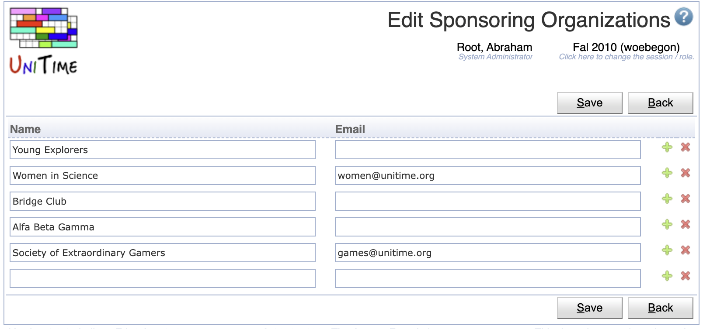

## Screen Description

A list of sponsoring organizations that is used for event management.

{:class='screenshot'}

## Details

There is a name and email address (if available) for each sponsoring organization.

* **Name**
	* Name of the sponsoring organization
	* Mandatory, must be unique

* **Email**
	* Contact email for the sponsoring organization
	* Not mandatory (but recommended)

If a sponsoring organization is provided with an email address, all notifications about events that are associated with the organization are sent to the organization's email address as well.

**Note:** When `unitime.events.sponsoringOrgRequired` is set to `true` in the [Application Configuration](application-configuration), all Special Events must have a sponsoring organization filled in.

## Operations

The table can be sorted by any of its columns, just by clicking on the column header and the sorting option that opens.

### Add Sponsoring Organization
Click **Add** to add a new sponsoring organization

{:class='screenshot'}

* Click **Save** to create a new sponsoring organization
* Click **Back** to return to the list without making any changes

### Edit Sponsoring Organization
Click a particular sponsoring organization to make changes or to delete the sponsoring organization

{:class='screenshot'}

* Click **Save** to make changes, **Back** to return to the list without making any changes
* Click **Previous** or **Next** to save the changes and go to the previous or next sponsoring organization respectively
* Click **Delete** to delete the sponsoring organization.

### Edit Sponsoring Organizations
Click **Edit** to edit all sponsoring organizations

{:class='screenshot'}

* Use the  icon to add a new line and  to delete a line
* Click **Save** to make changes, **Back** to return to the list without making any changes

### Export CSV/PDF
Click the **Export CSV** or **Export PDF** to export the list of sponsoring organizations to a CSV or PDF document respectively