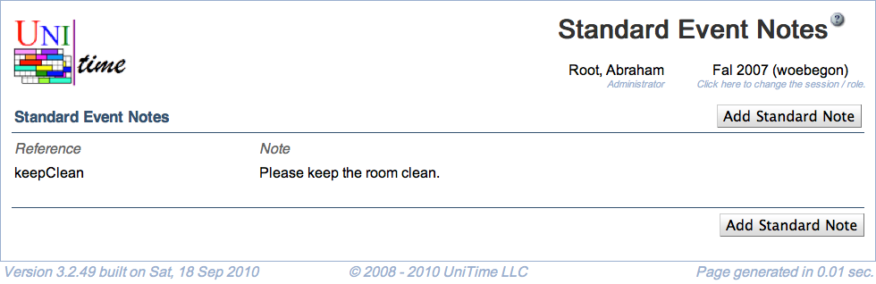

## Screen Description

A list of standard event notes that can be used by an event manager or an administrator when approving/rejecting an event. For administrators, the page is available at Administration > Other > Standard Event Notes in the menu. For event managers, the page is at Preferences > Standard Event Notes.

Standard event notes provide a quick way to event managers to fill in the event note without the need to type the same message over and over.

Standard notes can be global (available to all event managers across all the academic sessions), related to a single academic session, or to a particular department. Event managers can only create, edit, or delete departmental notes (standard notes that apply to their department).

## Details

* **Reference**
	* Short description of the note (e.g., used on [Event Detail](event-detail) page to order the notes)

* **Note**
	* Text of the note

* **Applies To**
	* Global: Event note is available to all event managers and administrators across all the academic sessions
	* Session: Event note is available to all event managers and administrators in the particular academic session
	* Department: Event note is available to event managers and administrators when approving events from the selected department

Click on any standard event note to get to its [Edit Standard Event Note](edit-standard-event-note) screen.

## Operations

* **Add Standard Note** (Alt+A)
	* Go to the [Add Standard Event Note](add-standard-event-note) screen to add a new standard event note

{:class='screenshot'}
