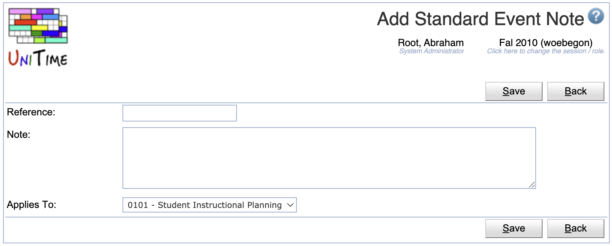
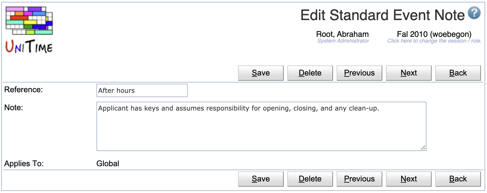

## Screen Description

A list of standard event notes that can be used by an event manager or an administrator when approving/rejecting an event. For administrators, the page is available at Administration > Other > Standard Event Notes in the menu. For event managers, the page is at Preferences > Standard Event Notes.

{:class='screenshot'}

Standard event notes provide a quick way to event managers to fill in the event note without the need to type the same message over and over.

Standard notes can be global (available to all event managers across all the academic sessions), related to a single academic session, or to a particular department. Event managers can only create, edit, or delete departmental notes (standard notes that apply to their department).

## Details

* **Reference**
	* Short description of the note (e.g., used on [Event Detail](event-detail) page to order the notes)

* **Note**
	* Text of the note

* **Applies To**
	* Global: Event note is available to all event managers and administrators across all the academic sessions
	* Session: Event note is available to all event managers and administrators in the particular academic session
	* Department: Event note is available to event managers and administrators when approving events from the selected department

## Operations

The table can be sorted by any of its columns, just by clicking on the column header and the sorting option that opens.

### Add Standard Event Note
Click **Add** to add a new standard event note

{:class='screenshot'}

* Click **Save** to create a new standard event note
* Click **Back** to return to the list without making any changes

### Edit Standard Event Note
Click a particular standard event note to make changes or to delete the standard event note

{:class='screenshot'}

* Click **Save** to make changes, **Back** to return to the list without making any changes
* Click **Previous** or **Next** to save the changes and go to the previous or next standard event note respectively
* Click **Delete** to delete the standard event note.

### Edit Standard Event Notes
Click **Edit** to edit all standard event notes

{:class='screenshot'}

* Use the  icon to add a new line and  to delete a line
* Click **Save** to make changes, **Back** to return to the list without making any changes

### Export CSV/PDF
Click the **Export CSV** or **Export PDF** to export the list of standard event notes to a CSV or PDF document respectively