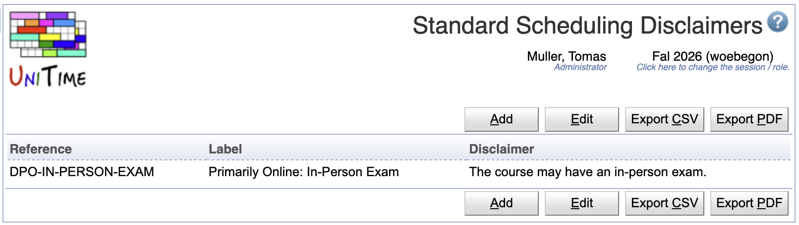
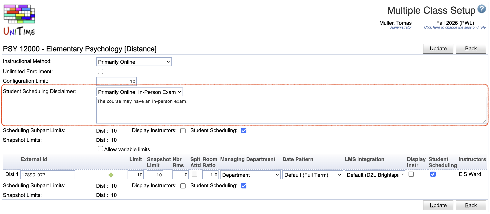
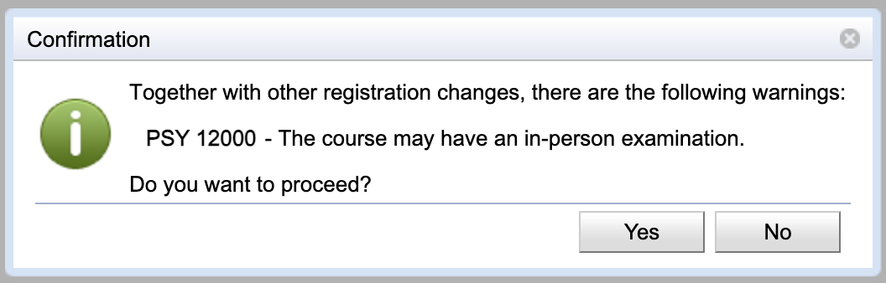
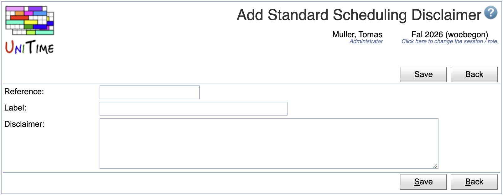
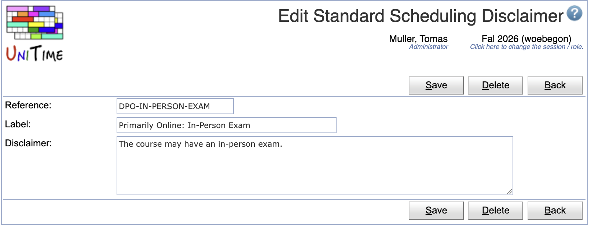
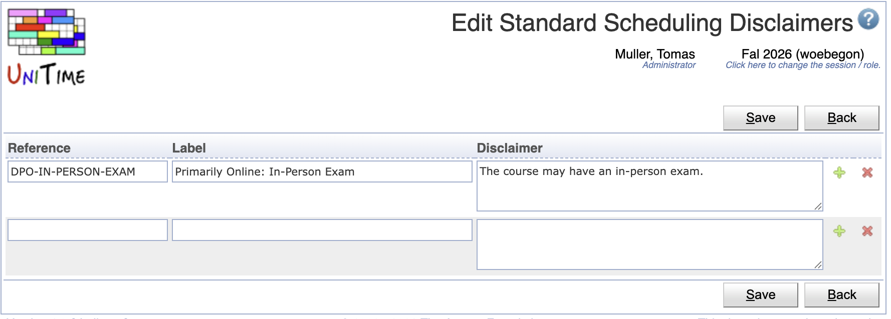

## Screen Description

The Standard Scheduling Disclaimers page can be used to define standard student scheduling disclaimers that can be reused on [Instructional Offering Configuration](instructional-offering-configuration) and [Multiple Class Setup](multiple-class-setup) pages for the Student Scheduling Disclaimer.

{:class='screenshot'}

When an instructional offering configuration has a disclaimer, it will show to the students when they request the course on [Student Course Requests](student-course-requests) or try to enroll in the configuration using the [Student Scheduling Assistant](student-scheduling-assistant) page. The student must acknowladge the disclaimer in order to proceed.

## Details

Each standard scheduling disclaimer has a reference, a label, and a text that is to be used. Reference and label must be unique.

When one or more standard scheduling disclaimers are defined, the [Instructional Offering Configuration](instructional-offering-configuration) or [Multiple Class Setup](multiple-class-setup) page will show a selection of available disclaimers:

{:class='screenshot'}

One of the standard disclaimers can be selected, or the "Other Disclaimers" option can be selected, in which case the user can edit the disclaimer directly on the configuration. When no standard disclaimers exist, only the text area shows.

For example, in the [Student Scheduling Assistant](student-scheduling-assistant), the disclaimer appears when the **Submit Schedule** button is clicked, and the student is either enrolling in a new course with the disclaimer (the disclaimer is on the configuration of the classes that the student wants to add) or when they are doing a swap from a different configuration to the one that has a disclaimer.

{:class='screenshot'}{:style='width:50%;'}

Standard scheduling disclaimers are academic session independent. The Standard Scheduling Disclaimers page can be accessed with the Scheduling Disclaimers permission, changes are permitted with the Scheduling Disclaimer Edit permission. Only timetable managers with Instr Offering Config Edit Disclaimer permission can set the disclaimer on [Instructional Offering Configuration](instructional-offering-configuration) and [Multiple Class Setup](multiple-class-setup) pages.

## Operations

The table can be sorted by any of its columns, just by clicking on the column header and the sorting option that opens.

### Add Standard Scheduling Disclaimer
Click **Add** to add a new standard scheduling disclaimer

{:class='screenshot'}

* Click **Save** to create a new standard scheduling disclaimer
* Click **Back** to return to the list without making any changes

### Edit Standard Scheduling Disclaimer
Click a particular standard scheduling disclaimer to make changes or to delete the standard scheduling disclaimer

{:class='screenshot'}

* Click **Save** to make changes, **Back** to return to the list without making any changes
* Click **Previous** or **Next** to save the changes and go to the previous or next standard scheduling disclaimer respectively
* Click **Delete** to delete the standard scheduling disclaimer.

### Edit Standard Scheduling Disclaimers
Click **Edit** to edit all standard scheduling disclaimers

{:class='screenshot'}

* Use the  icon to add a new line and  to delete a line
* Click **Save** to make changes, **Back** to return to the list without making any changes

### Export CSV/PDF
Click the **Export CSV** or **Export PDF** to export the list of standard scheduling disclaimers to a CSV or PDF document respectively