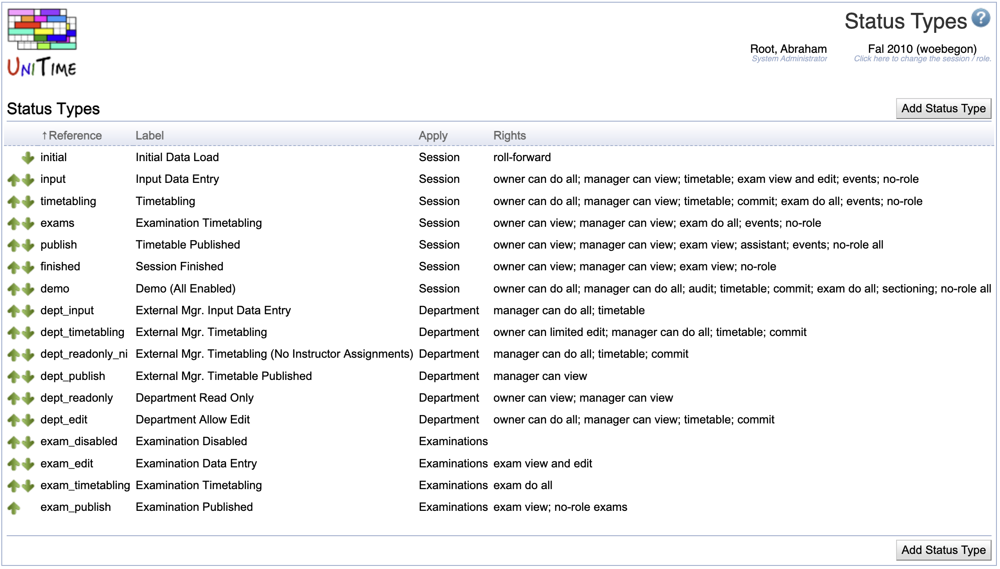

## Screen Description

 The Status Types screen provides a list of status types. Each status is defined by the rights the managers or owners have regarding viewing and/or editing their data.

## Details

* **Reference**
	* The name under which the application recognizes the status internally

* **Label**
	* Name of the status displayed throughout the application (for example, in the [Academic Sessions](academic-sessions) screen)

* **Apply**
	* Indicates whether a given status should be applicable only to a session, only to a department, or to both (for example, "Initial Data Load" applies to a session only while "External Manager Timetabling" applies to a department only)

* **Rights**
	* Rights associated with this status
	* To see a description of each of these rights, click on the status type to get to the [Edit Status Type](edit-status-type) screen

 Click on any status type to get to its [Edit Status Type](edit-status-type) screen.

## Operations

* **Add Status Type**
	* Add a new status type in the [Add Status Type](add-status-type) screen

* **Up** and **down** arrows
	* Move the status type up or down in the list of Status Types
	* The statuses are displayed in other screens (such as [Edit Department](edit-department)) in the same order in which they are listed in this screen

{:class='screenshot'}

