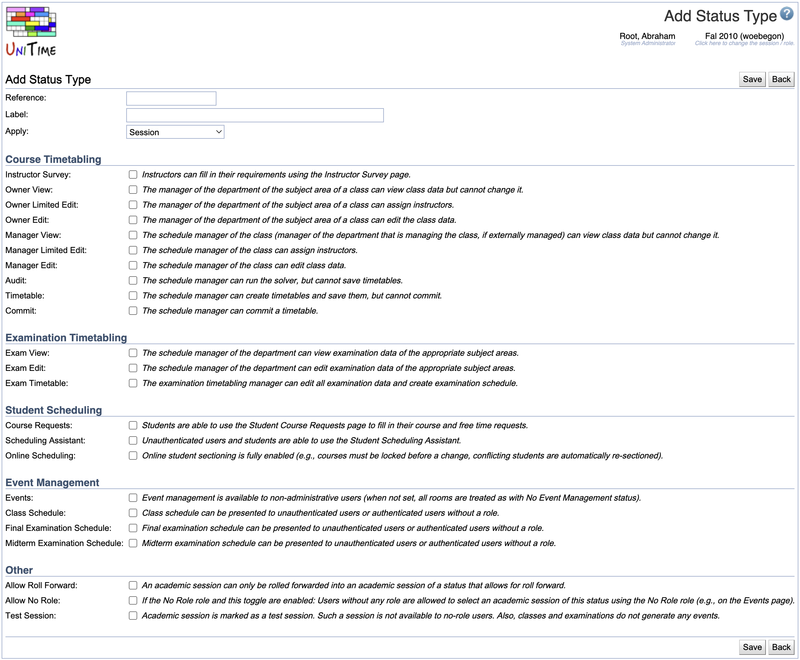

## Screen Description

The Status Types screen provides a list of status types. Each status is defined by the rights the managers or owners have regarding viewing and/or editing their data.

{:class='screenshot'}

## Details

* **Reference**
    * The name under which the application recognizes the status internally

* **Label**
    * Name of the status displayed throughout the application (for example, in the [Academic Sessions](academic-sessions) screen)

* **Apply**
    * Indicates whether a given status should be applicable only to a session, only to a department, or to both (for example, "Initial Data Load" applies to a session only while "External Manager Timetabling" applies to a department only)
    * Possible options:
        * **Session**: applies to an academic session (can be used on the [Academic Sessions](academic-sessions) page)
        * **Department**: applies to a department (can be used on the [Departments](departments) page)
        * **Examinations**: applies to an examination problem (can be used on the [Examination Statuses](examination-statuses) page)
        * **Session &amp; Department**: applies to an academic session or a department
        * **All**: applies to all (can be used on any of the three pages)

* **Rights**
    * Rights associated with this status
    * Additional description of each right is on the Edit Status Type screen when a status type is clicked

The rights are divided into several categories:
* **Course Timetabling**
    * Owner/manager rights related to creating a course timetable
    * **Owner** is a Departmental Schedule Manager from the department of the controlling course (controlling department)
    * **Manager** is a Departmental Schedule Manager from the department that manages the class (the external department if the class is externally managed, the controlling department otherwise)
* **Examination Timetabling**
    * A set of rights related to (final/midterm) examination timetabling
* **Student Scheduling**
    * A set of rights related to student scheduling
* **Event Management**
    * A set of rights related to event management
    * Includes publishing of class and/or examination schedules (they become visible in the Event Management)
* **Other**
    * Additional rights

## Operations

Sort the table by any column by clicking the column header. The second click on the same header will reverse the order.

Use  and  arrows to move the status type up or down in the list of Status Types
* The statuses are displayed in other screens (such as [Edit Department](edit-department)) in the same order in which they are listed in this screen

### Add Status Type

Click **Add Status Type** to add a new status type

{:class='screenshot'}

#### Operations

* Click **Save** (Alt+S) to save this new status type and go back to the list of status types
* Click **Back** (Alt+B) to go back to the list of status types without making any changes

### Edit Status Type

Click on any status type to make changes

{:class='screenshot'}

* Click **Update** to save changes and go to the list of status types
* Click **Delete** to delete this status type and go back to the list of status types
* Click **Back** to go back to the list of status types without saving any changes
