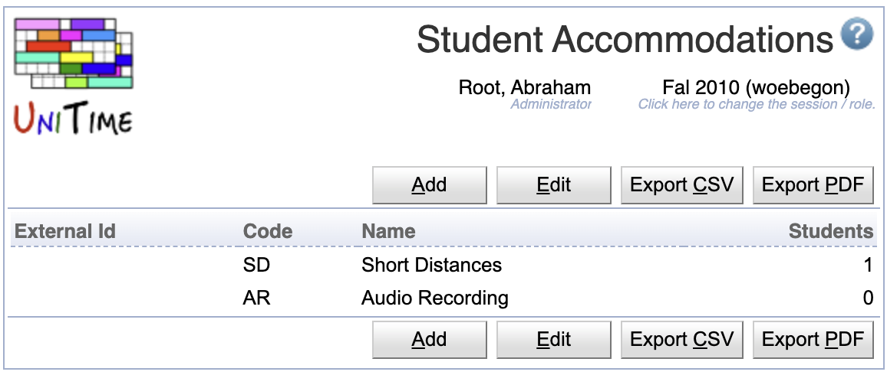
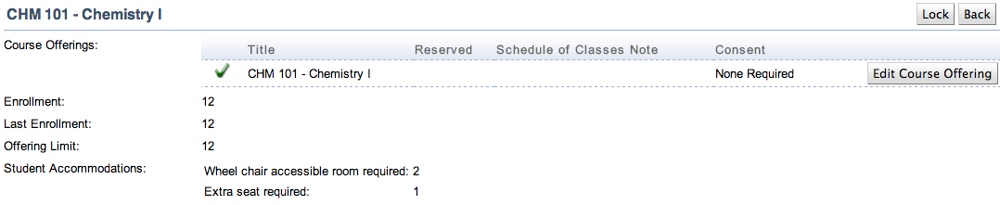

## Screen Description

The Student Accommodations screen provides an overview of student accommodations (special needs or disabilities) in UniTime. If a student accommodation has an external id, it cannot be edited in UniTime.

{:class='screenshot'}

## Details

The table of student accommodations contains the following information

* **External Id**
	* Id of the accommodation as used outside UniTime

* **Code**
	* Code or abbreviation of the accommodation name

* **Name**
	* Name of the accommodation

* **Students**
	* Number of students with the accommodation

Clicking on any of the student accommodations takes you to the [Edit Student Accommodations](edit-student-accommodations) screen where you can edit that particular accommodation.

## Operations

* **Add**
	* Go to the [Add Student Accommodation](add-student-accommodation) screen to add a new student accommodation

* **Edit**
	* Go to the [Edit Student Accommodations](edit-student-accommodations) screen to edit all of the student accommodations at once

## Notes

If there are students with accommodations, all pages that have Enrollments table ([Instructional Offering Detail](instructional-offering-detail), [Class Detail](class-detail), [Examination Detail](examination-detail), [Event Detail](event-detail)): if there is at lest one student with an accommodation (disability) enrolled, Accommodation column will appear with the code of the accommodation. The table can be also sorted by this column.

{:class='screenshot'}

Besides of the Enrollments table, there an overview with student accommodations is displayed in the Student Accommodation property at the top of the page ([Instructional Offering Detail](instructional-offering-detail), [Class Detail](class-detail), [Examination Detail](examination-detail)). The Student Accommodations table is only present if there is at least one student with an accommodation. It contains the name of the accommodation (or accommodations) and the number of students with such accommodation enrolled in the offering, class, or examination.

{:class='screenshot'}
