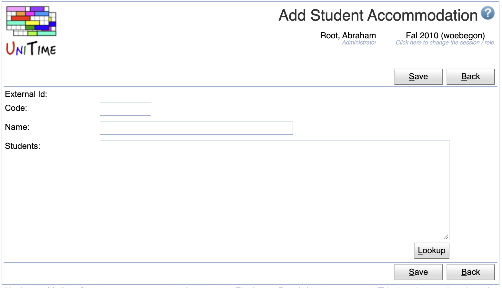
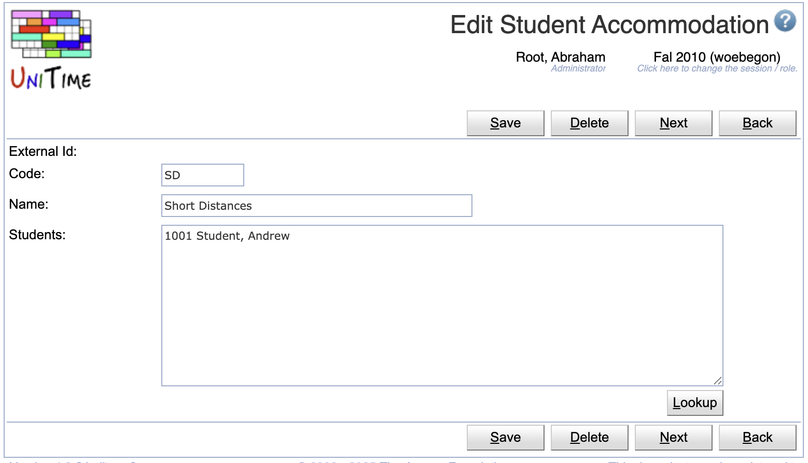
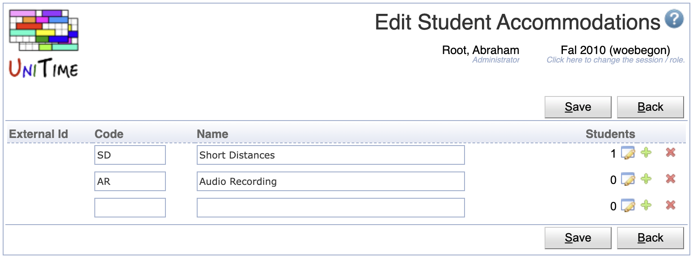
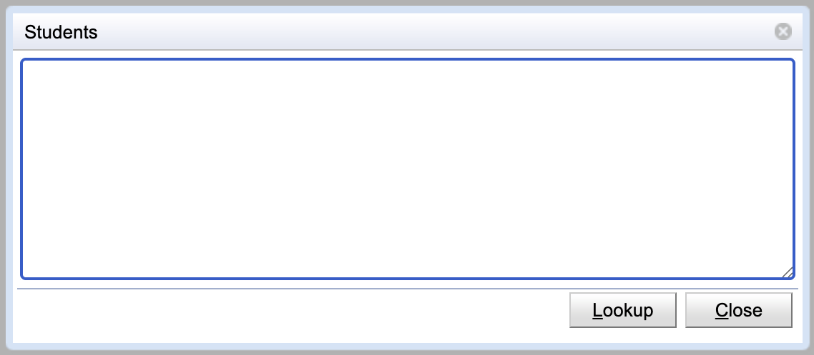

## Screen Description

The Student Accommodations screen provides an overview of student accommodations (special needs or disabilities) in UniTime. If a student accommodation has an external id, it cannot be edited in UniTime.

{:class='screenshot'}

Student accommodations can be used by the student scheduling solver. These can be registered using the [Create Student Accommodations Solver Configuration Parameters.xml](https://raw.githubusercontent.com/UniTime/unitime/refs/heads/master/Documentation/Scripts/Create%20Student%20Accommodations%20Solver%20Configuration%20Parameters.xml) script: Import the XML page using the [Data Exchange](data-exchange) page and then run the Student Scheduling: Student Accommodations Solver Configuration Parameters script using the [Scripts](scripts) page. There are the following criteria:
* **Short Distances**: there is a short distance conflict for all students of the SD accommodation when two consecutive classes with non-zero travel time
* **Free Time**: higher penalization for time conflict between a class and a free time request for students with FT accommodation
* **Back-to-Back**: a back-to-back conflict (for students with BTB accommodation) occurs every time a student has two consecutive classes that are more than 30 minutes apart
* **Break Between Classes**: a no-break-between-classes conflict (for students with BBC accommodation) occurs every time a student has two consecutive classes that are less than 30 minutes apart

## Properties

Each student accommodation contains the following properties:

* **External Id**
	* External ID of the student accommodation
	* External IDs are only editable via the [XML import](https://www.unitime.org/uct_interfaces.php)
	* Student accommodations with an external ID cannot be deleted. The presence of the External ID indicates that the student accommodation has been imported from an external system.

* **Code**
	* Code or abbreviation of the accommodation name

* **Name**
	* Name of the accommodation

* **Students**
	* Number of students with the accommodation
	* Add/Edit: list of individual students with the accommodation
	* Editable only for accommodations that have been added directly in UniTime (not editable for the student accommodations with External Ids)

## Operations

The table can be sorted by any of its columns, just by clicking on the column header and the sorting option that opens.

### Add Student Accommodation
Click **Add** to add a new student accommodation

{:class='screenshot'}

* The **Students** text field contains the external IDs of students that are to be listed in the accommodation (one per line, anything after the first space is ignored)
	* It is possible to use the **Lookup** button and look the students up one by one or to copy a list of External Ids of the students to the text field
	* The Lookup button opens to the [People Lookup](people-lookup) dialog (however, only existing students are available to be looked up)
* Click **Save** to create a new student accommodation
* Click **Back** to return to the list without making any changes

### Edit Student Accommodation
Click a particular student accommodation to make changes or to delete the accommodation

{:class='screenshot'}

* The **Students** text field contains the external IDs of students that are to be listed in the accommodation
	* The list contains one student per line, containing the external id and the name of the student (anything after the first space is ignored on each line during the update)
	* Editable only for accommodations that have been added through the [Add Student Accommodation](add-student-accommodation) screen in UniTime (not editable for the student accommodations with External Ids)
	* It is possible to use the **Lookup** button and look the students up one by one or to copy a list of External Ids of the students to the text field
	* The Lookup button opens to the [People Lookup](people-lookup) dialog (however, only existing students are available to be looked up)
* Click **Save** to make changes, **Back** to return to the list without making any changes
* Click **Previous** or **Next** to save the changes and go to the previous or next student accommodation respectively
* Click **Delete** to delete the student accommodation. Student accommodations with an external ID (i.e., that has been imported from an external system) cannot be deleted.

### Edit Student Accommodations
Click **Edit** to edit all student accommodations

{:class='screenshot'}

* Use the  icon to add a new line and  to delete a line
* Click the  icon to edit the list of students for the accommodation

	{:style='max-width:50%;'}

* Accommodations with an external ID (i.e., that has been imported from an external system) cannot be deleted
* Click **Save** to make changes, **Back** to return to the list without making any changes

### Export CSV/PDF
Click the **Export CSV** or **Export PDF** to export the list of student accommodations to a CSV or PDF document respectively

## Notes

If there are students with accommodations, all pages that have Enrollments table ([Instructional Offering Detail](instructional-offering-detail), [Class Detail](class-detail), [Examination Detail](examination-detail), [Event Detail](event-detail)): if there is at lest one student with an accommodation (disability) enrolled, Accommodation column will appear with the code of the accommodation. The table can be also sorted by this column.

{:class='screenshot'}

Besides of the Enrollments table, there an overview with student accommodations is displayed in the Student Accommodation property at the top of the page ([Instructional Offering Detail](instructional-offering-detail), [Class Detail](class-detail), [Examination Detail](examination-detail)). The Student Accommodations table is only present if there is at least one student with an accommodation. It contains the name of the accommodation (or accommodations) and the number of students with such accommodation enrolled in the offering, class, or examination.

{:class='screenshot'}
