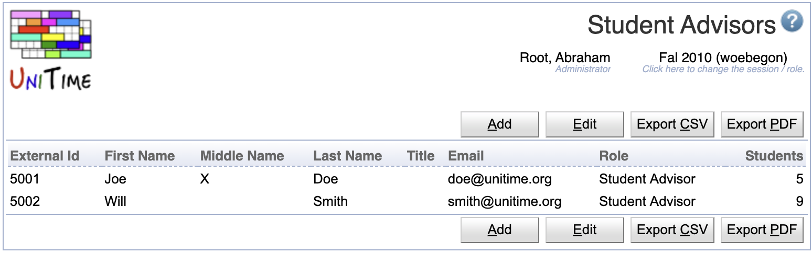

## Screen Description

The Student Advisors page can be used to define student advisors and their association with one or more students.

This table is used for authentication (to grant a user the student advisor role) and to populate the My Students filter on the [Online Student Scheduling Dashboard](online-student-scheduling-dashboard) page. An advisor may be allowed to only modify his/her students by using the following permissions:

* **Student Scheduling Advisor Can Modify My Students**
	* Student advisor can make changes on behalf of his/her students

* **Student Scheduling Advisor Can Modify All Students**
	* Student advisor can make changes on behalf of any student

Student advisors can be also loaded in using the Student Advisor XML format.

## Details

Each advisor has the following properties:

* External Id
	* The external id must match the external id of the authenticated user.

* First Name, Middle Name, Last Name, Title
	* Advisor's name and academic title (optional fields)

* Email
	* Advisor's email address (optional)

* Role
	* Advisor role (only roles with Student Scheduling Advisor permission can be selected)

* Students
	* List of students that the advisor is advising (can see and/or modify using the [Online Student Scheduling Dashboard](online-student-scheduling-dashboard) page)

Click on any line with a student advisor to get to its __Edit Student Advisor__ screen.

## Operations

* **Add**
	* Go to the __Add Student Advisor__ screen to add a new student advisor

* **Edit**
	* Go to the __Edit Student Advisors__ screen to edit all the student advisors at once

{:class='screenshot'}
