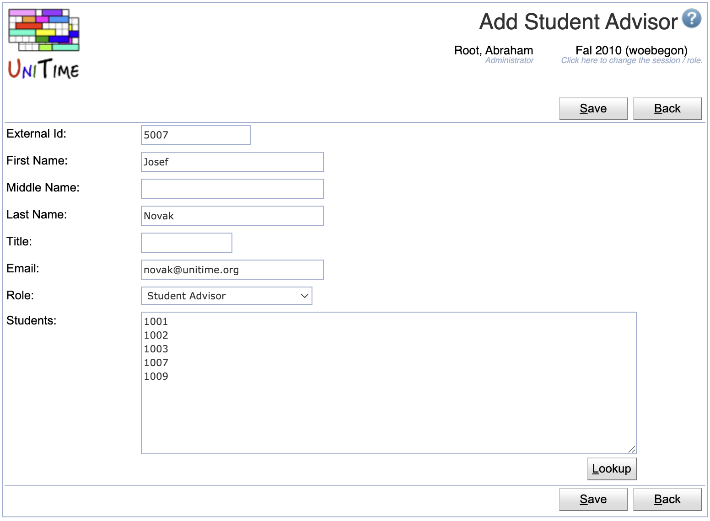
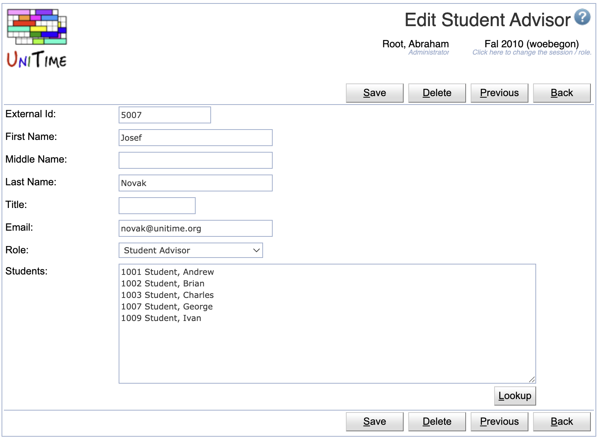
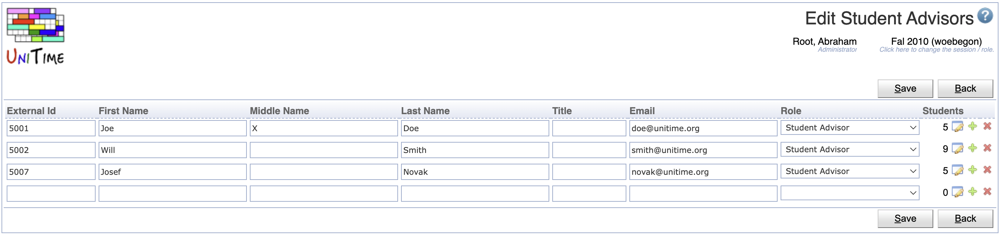
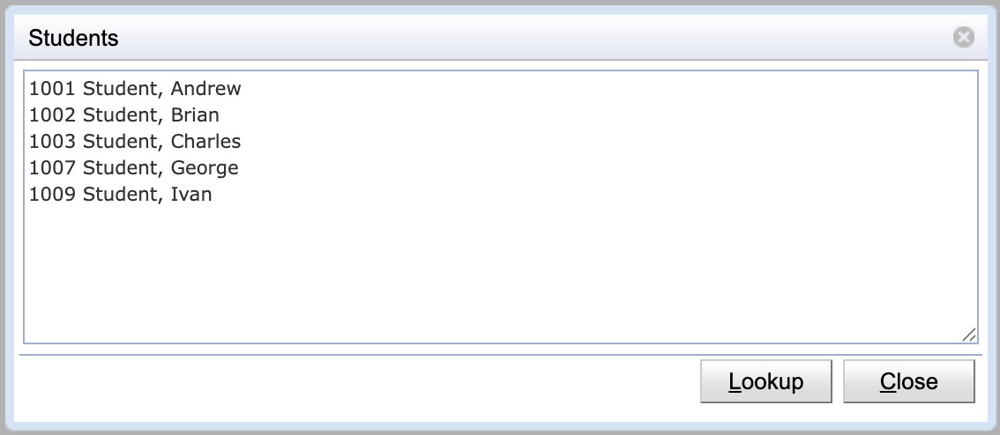

## Screen Description

The Student Advisors screen displays and allows editing of the list of available student advisors for the current academic session.

{:class='screenshot'}

This table is used for authentication (to grant a user the student advisor role) and to populate the *My Students* filter on the [Online Student Scheduling Dashboard](online-student-scheduling-dashboard) page. An advisor may be allowed to only modify his/her students by using the following permissions:

* **Student Scheduling Advisor Can Modify My Students**
	* Student advisor can make changes on behalf of his/her students

* **Student Scheduling Advisor Can Modify All Students**
	* Student advisor can make changes on behalf of any student

Student advisors can be also loaded in using the [Student Advisor XML](xml) format.

## Properties

Each advisor has the following properties:

* **External Id**
	* The external ID must match the external ID of the authenticated user.

* **First Name**, **Middle Name**, **Last Name**, **Title**
	* Advisor's name and academic title (optional fields)

* **Email**
	* Advisor's email address (optional)
 
* **Role**
	* Advisor role (only roles with the **Student Scheduling Advisor** permission can be selected)

* **Students**
	* Number of students that the advisor is advising (can see and/or modify using the [Online Student Scheduling Dashboard](online-student-scheduling-dashboard) page or advise using the [Advisor Course Recommendations](advisor-course-recommendations) page)
	* Add/Edit: list of individual students of the advisor

## Operations

The table can be sorted by any of its columns, just by clicking on the column header and the sorting option that opens.

### Add Student Advisor
Click **Add** to add a new student advisor

{:class='screenshot'}

* The **Students** text field contains the external IDs of students of the advisor (one per line, anything after the first space is ignored)
	* It is possible to use the **Lookup** button and look the students up one by one or to copy a list of External Ids of the students to the text field
	* The Lookup button opens to the [People Lookup](people-lookup) dialog (however, only existing students are available to be looked up)
* Click **Save** to create a new student advisor
* Click **Back** to return to the list without making any changes

### Edit Student Advisor
Click a particular student advisor to make changes or to delete the advisor

{:class='screenshot'}

* The **Students** text field contains the external IDs of students of the advisor
	* The list contains one student per line, containing the external ID and the name of the student (anything after the first space is ignored on each line during the update)
	* It is possible to use the **Lookup** button and look the students up one by one or to copy a list of External Ids of the students to the text field
	* The Lookup button opens to the [People Lookup](people-lookup) dialog (however, only existing students are available to be looked up)
* Click **Save** to make changes, **Back** to return to the list without making any changes
* Click **Previous** or **Next** to save the changes and go to the previous or next student advisor respectively
* Click **Delete** to delete the student advisor

### Edit Student Advisors
Click **Edit** to edit all student advisors

{:class='screenshot'}

* Use the  icon to add a new line and  to delete a line
* Click the  icon to edit the list of students of the advisor

	{:style='max-width:50%;'}

* Click **Save** to make changes, **Back** to return to the list without making any changes

### Export CSV/PDF
Click the **Export CSV** or **Export PDF** to export the list of student advisors to a CSV or PDF document respectively
