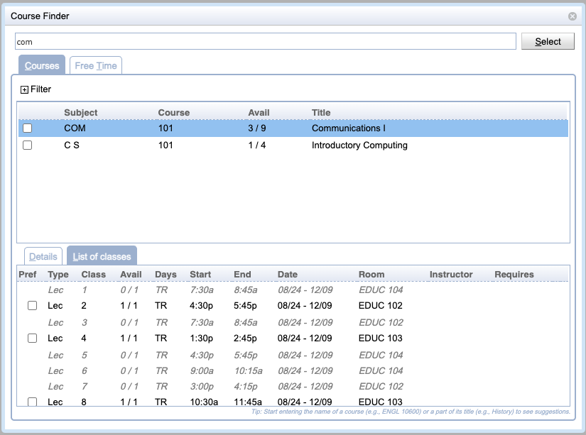
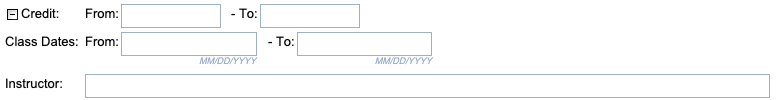
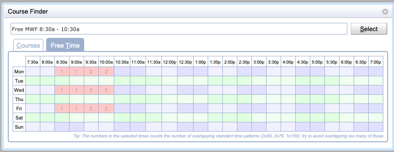

## Screen Description

The Course Finder screen provides tools to look up a course or find information about a course. When the screen is opened from a line with a course, the course description appears, otherwise it is opened without any course information.

{:class='screenshot'}

## Details

### Filter

The top-most editable field is the filter field. As soon as the user starts entering letters or digits, a list of courses containing that character will appear in the table below. It is possible to filter by the course abbreviation, as well as the long name of the course.

### Courses

The course table contains courses that fit the criteria entered in the filter field above. Click on any course to display details in the third part of the screen.

* **Subject**
	* Subject Area
* **Course**
	* Course Number
* **Avail**
	* Number of free, still available seats / capacity of the course
	* Negative number means that the class is overbooked
* **Title**
	* Course title
* **Credit**
	* Course credits
	* Only available if there is at least one course with course credits filled in
* **Note**
	* Course note
	* Only available if there is at least one course with a note on the list
* **WL/Override**
	* Indicates whether the wait-listing is available for the course, or if a closed section override can be requested
	* Only available if there is at least one course that can be wait-listed or allows for a closed section override

Additional course filtering capabilties are available when the Filter is opened by clicking the plus icon , allowing to filter courses by credits, class dates, and/or instructor name.

Multiple courses can be selected by using the check-boxes on the left side of the table. This allows to select the course and its alternatives in one use of the dialog. The courses need to be checked in the order they are to be listed on the screen from which the Course Finder dialog was opened.

{:class='screenshot'}

### Free Time

Free Time tab is displayed in this section when the screen is used to pick courses/free time requests for the Student Scheduling Assistant. To select free times, the user needs to click on the fields with appropriate time slots and then press Enter to go back to the [Student Scheduling Assistant](student-scheduling-assistant) or [Student Course Requests](student-course-requests) screen.

{:class='screenshot'}

### Course information

There are three types of information to be displayed about the course

#### Details

Details about the course as listed in the course catalog

#### Classes

A list of classes as defined in the Instructional Offerings section of the timetabling application.

Classes that are not available for the student are grayed out. These are typically classes that are already full, but can also be classes that are reserved for some other students.

* **Pref**
	* Check the toggle to indicate that the class is preferred

* **Type**
	* Type of class (Lecture, Recitation, ...)

* **Class**
	* Identification of the class

* **Avail**
	* Number of free, still available seats / capacity of the class 
	* Negative number means that the class is overbooked

* **Days**
	* Days of the week

* **Start**
	* Start time of the class

* **End**
	* End time of the class

* **Date**
	* Dates during the semester on which the class is taught

* **Room**
	* Room where the class meets

* **Instructor**
	* Instructor for the class

* **Requires**
	* Identification of other classes from the List of Classes that are required to be taken together with this class (for example, a specific lecture may be required for a given recitation)

If the course has multiple course configurations with different instructional method, it is possible to prefer one of the instructional methods by clicking the appropriate checkbox.

## Notes

To close the Course Finder screen, press Esc or click on any place of the previous screen (outside the current screen). When you need to select a course or free time for the Student Scheduling Assistant screen, click on the course/free time and then press Enter.

