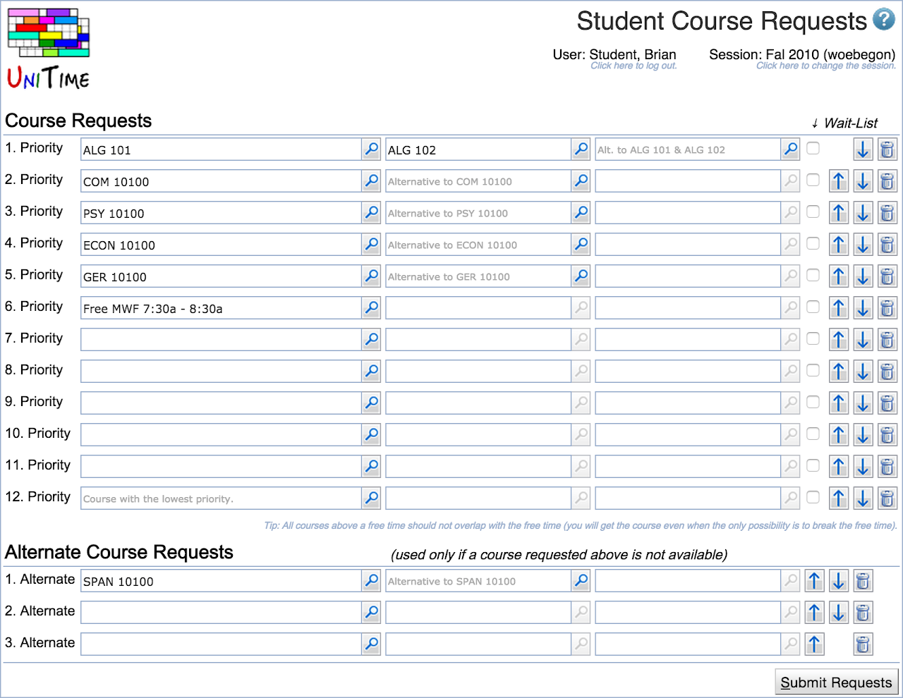
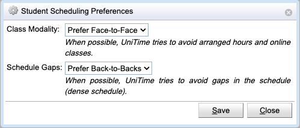

## Screen Description

The Student Course Requests page can be used to collect course requests (course pre-registrations) from students. It is a variant of the [Student Scheduling Assistant](student-scheduling-assistant) page, without the ability to create a student schedule right away. The course requests can be collected during the timetabling process, once it is known which courses are going to be offered. Once student course requests are collected, the [Student Sectioning Solver](student-scheduling-solver) can be used to create an optimize schedule for all the students. After that the online student scheduling can be enabled, so that students can use the [Student Scheduling Assistant](student-scheduling-assistant) page to review their schedule and/or to make any modifications they need/desire.

{:class='screenshot'}

The student can use the screen to set up a list of prioritized courses with alternatives and free time requests.

**Course Requests**

Table of courses ordered by student's priority (courses on the first line have the highest priority). Each course can have up to two alternatives that have the same priority for the student as his/her first choice on a given line. The second or third choice are only used if the first choice is unavailable or does not fit with higher priority courses in the list.

Click on the magnifying glass to get to the [Course Finder](student-course-finder) screen for more information about possible courses.

To move a line with a course and its alternatives one line up or one line down, click on the appropriate arrow at the end of the line.

If a course (or any of its alternatives, if provided) is not available to the student for some reason, it is possible to either give a substitute course (see the Substitute Course Requests table bellow) or toggle the Wait-List checkbox. If the Wait-List is marked and the student cannot be enrolled into the course, he/she will be automatically put on a wait-list for the course.

**Substitute Course Requests**

Table of substitute courses in the order of priority. These substitutes will be used if some of the courses from the Courses table and their alternatives cannot be scheduled (due to conflicts with higher priority courses or because they are full already).

**Operations**

* **Preferences**
	* Additional preferences that apply to all the requested courses

		

	* Prefer face-to-face or online courses
	* Prefer or discourage back-to-back classes
	* When enabled (typically for Summer terms), it is also possible to
		* require online courses, or
		* set start/end dates for the classes (only classes offered between the selected dates would be available)

* **Current Registration**
	* Discard the current changes and go back to the previously submitted requests.

* **Submit Requests**
	* Store the entered data in the database.

## Notes

The user must click the Submit Request button in order to persist the changed made on the page.

**Free time requests**

There are two ways to enter a free time request

1. In the list of courses, enter the request in the form of "Free F 10:00a - 10:30a" or "Free TR 2:00p - 3:00p" etc.
2. Go to the [Course Finder](student-course-finder) screen and click on the "Free Time" tab; then click on the times that should stay free and then press Enter
