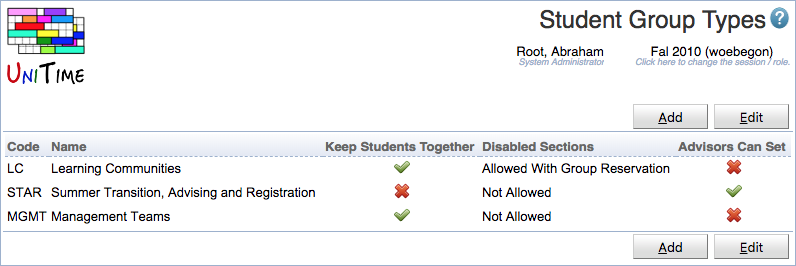

## Screen Description

The Student Group Types page allows to define types of student groups. This way, student groups can be grouped by their type. There are additional properties that can be defined for each groups of a particular type.

{:class='screenshot'}

## Details

Each student group type can have a code, a name, and the following properties:

* **Keep Students Together**
	* When set to true, the student scheduling solver will try to keep students of such groups together.

* **Disabled Sections**
	* It is possible for certain student groups to allow students to enroll in classes that are disabled for student scheduling. The possible values are:
	* **Not Allowed**: students of such group are not allowed to see or enroll in disabled classes (this is the default)
	* **Allowed With Group Reservation**: students of such a group can enroll in a disabled class if there is a student group reservation for their group
	* **Allways Allowed**: students of such a group can enroll in any disabled class

* **Advisors Can Set**
	* Advisors and admins can use the [Online Student Scheduling Dashboard](online-student-scheduling-dashboard) to add or remove a student from a group of this type

Click on any line with a status type to get to its [Edit Student Group Type](edit-student-group-type) screen.

## Operations

* **Add**
	* Go to the [Add Student Group Type](add-student-group-type) screen to add a new student group type

* **Edit**
	* Go to the [Edit Student Group Types](edit-student-group-types) screen to edit all the student group types at once
