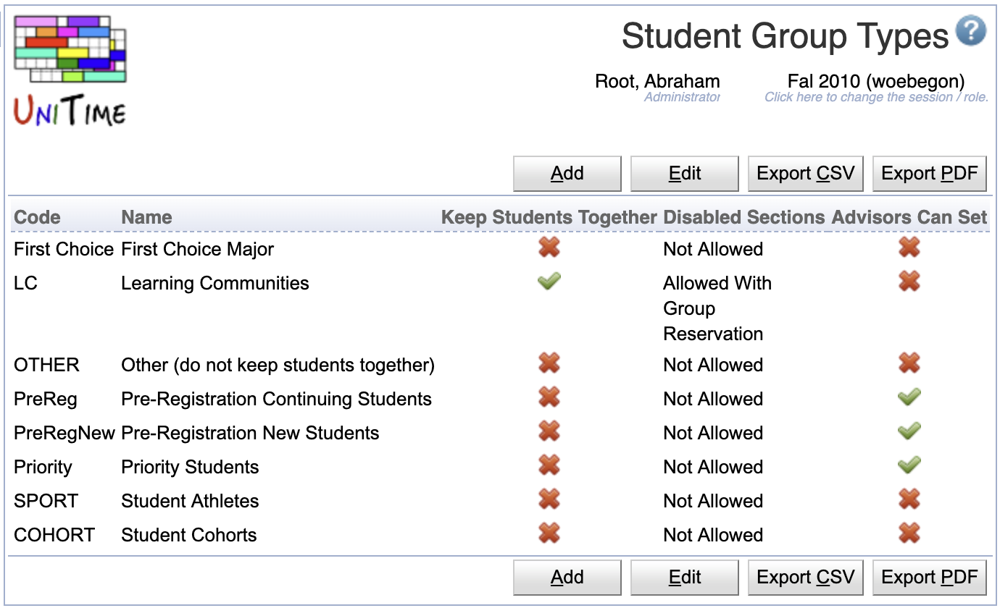

## Screen Description

The Student Group Types screen displays and allows editing of the list of available types of student groups. This way, student groups can be grouped by their type. There are additional properties that can be defined for each groups of a particular type.

{:class='screenshot'}

These group types are also used be various pages. For instance, the [Online Student Scheduling Dashboard](online-student-scheduling-dashboard) will split the student groups by type in the filter, and each type also forms a separate column with the codes of student groups of that type that the student belongs to.

## Properties

Each student group type can have a code, a name, and the following properties:

* **Code**
	* Code of the student group type

* **Name**
	* Name of the student group type

* **Keep Students Together**
	* When set to true, the student scheduling solver will try to keep students of such groups together.

* **Disabled Sections**
	* It is possible for certain student groups to allow students to enroll in classes that are disabled for student scheduling. The possible values are:
	* **Not Allowed**: students of such group are not allowed to see or enroll in disabled classes (this is the default)
	* **Allowed With Group Reservation**: students of such a group can enroll in a disabled class if there is a student group reservation for their group
	* **Always Allowed**: students of such a group can enroll in any disabled class

* **Advisors Can Set**
	* Advisors and admins can use the [Online Student Scheduling Dashboard](online-student-scheduling-dashboard) to add or remove a student from a group of this type

## Operations

The table can be sorted by any of its columns, just by clicking on the column header and the sorting option that opens.

### Add Student Group Type
Click **Add** to add a new group type

{:class='screenshot'}

* Click **Save** to create a new group type
* Click **Back** to return to the list without making any changes

### Edit Student Group Type
Click a particular group type to make changes or to delete the group type

{:class='screenshot'}

* Click **Save** to make changes, **Back** to return to the list without making any changes
* Click **Previous** or **Next** to save the changes and go to the previous or next group type respectively
* Click **Delete** to delete the group type. Group types that are being used cannot be deleted.

### Edit Student Group Types
Click **Edit** to edit all group types

{:class='screenshot'}

* Use the  icon to add a new line and  to delete a line
* Group types that are being used cannot be deleted
* Click **Save** to make changes, **Back** to return to the list without making any changes

### Export CSV/PDF
Click the **Export CSV** or **Export PDF** to export the list of student group types to a CSV or PDF document respectively