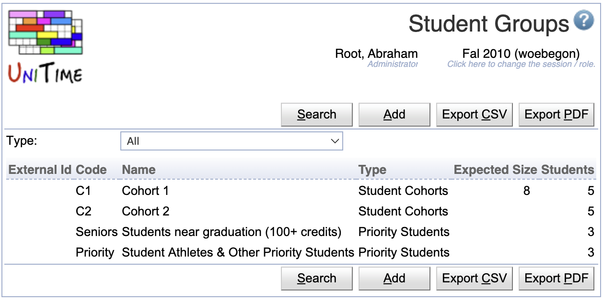
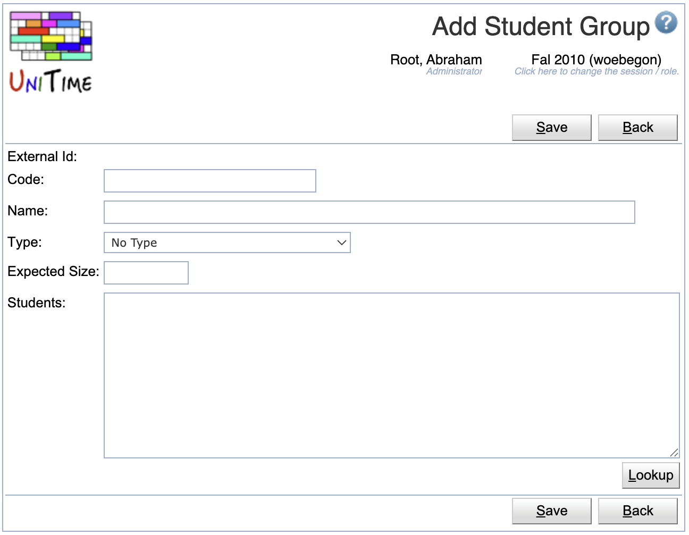
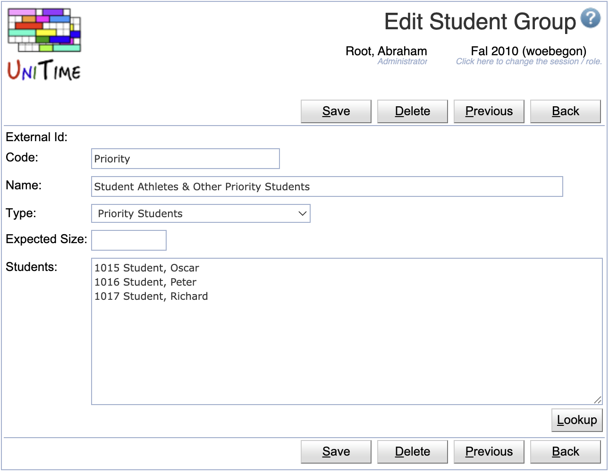

## Screen Description

The Student Groups screen displays and allows editing of the list of available student groups for the current academic session.

{:class='screenshot'}

Student groups are useful in many ways in UniTime. They allow to put any list of students into a group, which can be used for student scheduling, e.g., by creating a [Group Reservation](reservations) or to filter by the group in the [Online Student Scheduling Dashboards](online-student-scheduling-dashboard). The groups can also be used to prioritize certain students in the student scheduling solver.

## Properties

Each student group contains the following properties:

* **External Id**
	* External ID of the student group
	* External IDs are only editable via the [XML import](xml)
	* Student groups with an external ID cannot be deleted. The presence of the External ID indicates that the student group has been imported from an external system.

* **Code**
	* Code or abbreviation of the student group name

* **Name**
	* Name of the student group

* **Type**
	* An optional type of the group (the various types can be edited on the [Student Group Types](student-group-types) screen)

* **Expected Size**
	* Expected number of students in the group
	* An optional field

* **Students**
	* Number of students in the student group
	* Add/Edit: list of individual students in the group
	* Editable only for groups that have been added through the [Add Student Group](add-student-group) screen in UniTime (not editable for the student groups with External Ids)

## Operations

The table can be filtered by the group type. Click **Search** to populate the page based on the selected type.

The table can be sorted by any of its columns, just by clicking on the column header and the sorting option that opens.

### Add Student Group
Click **Add** to add a new student group

{:class='screenshot'}

* The **Students** text field contains the external IDs of students that are to be listed in the group (one per line, anything after the first space is ignored)
	* It is possible to use the **Lookup** button and look the students up one by one or to copy a list of External Ids of the students to the text field
	* The Lookup button opens to the [People Lookup](people-lookup) dialog (however, only existing students are available to be looked up)
* Click **Save** to create a new student group
* Click **Back** to return to the list without making any changes

### Edit Student Group
Click a particular student group to make changes or to delete the student group

{:class='screenshot'}

* The **Students** text field contains the external IDs of students that are to be listed in the group
	* The list contains one student per line, containing the external id and the name of the student (anything after the first space is ignored on each line during the update)
	* Editable only for groups that have been added through the [Add Student Group](add-student-group) screen in UniTime (not editable for the student groups with External Ids)
	* It is possible to use the **Lookup** button and look the students up one by one or to copy a list of External Ids of the students to the text field
	* The Lookup button opens to the [People Lookup](people-lookup) dialog (however, only existing students are available to be looked up)
* Click **Save** to make changes, **Back** to return to the list without making any changes
* Click **Previous** or **Next** to save the changes and go to the previous or next student group respectively
* Click **Delete** to delete the student group. Student groups with an external ID (i.e., that has been imported from an external system) cannot be deleted.

### Export CSV/PDF
Click the **Export CSV** or **Export PDF** to export the list of student groups to a CSV or PDF document respectively