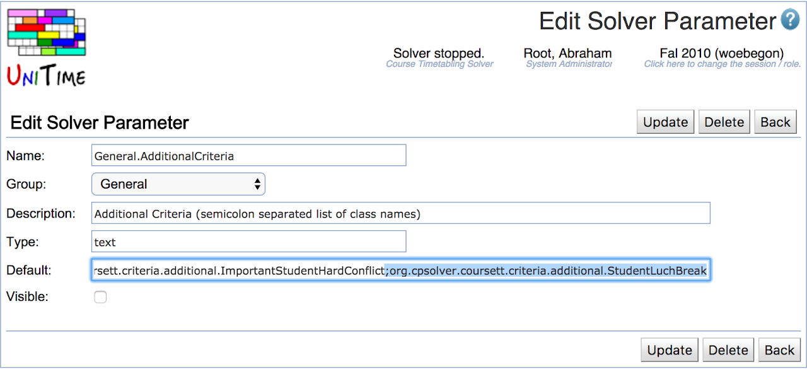
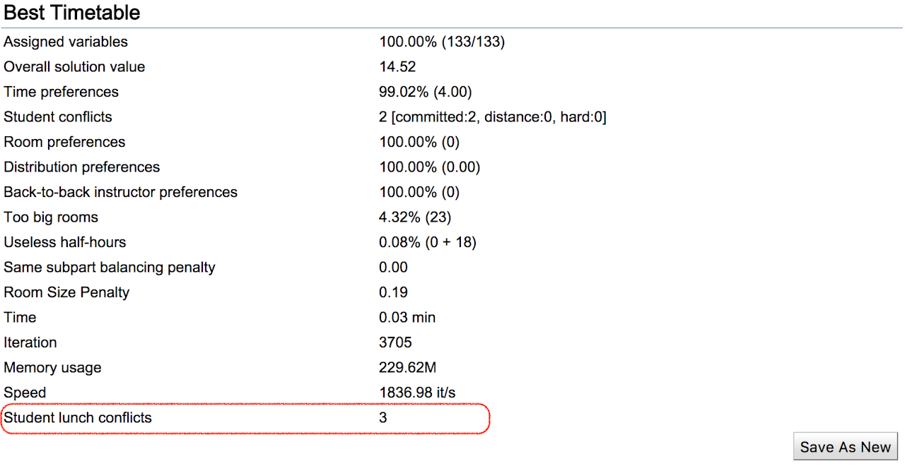
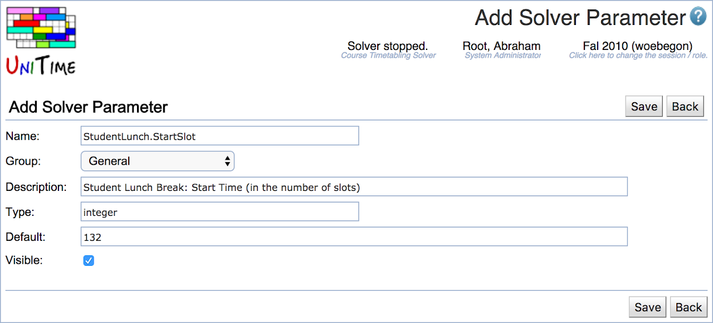

## Criterion Description

 The [StudentLuchBreak](https://github.com/UniTime/cpsolver/blob/master/src/org/cpsolver/coursett/criteria/additional/StudentLuchBreak.java) additional criterion penalizes cases when there are two classes sharing students overlapping with the lunchtime that is one after the other with a break in between smaller than the requested lunch break. It creates a student lunch break conflict every time a student has two classes overlapping the lunch period (by default between 11:00 and 13:30) that have less than 30 minutes in between. While this approach is quite naive, it works surprisingly well, especially when most classes are longer than an hour.

## Configuration

 On the Administration > Solver > Solver Parameters page, the [StudentLuchBreak](https://github.com/UniTime/cpsolver/blob/master/src/org/cpsolver/coursett/criteria/additional/StudentLuchBreak.java) criterion must be added to the General.AdditionalCriteria parameter. For instance, you can put the following text:

 ;org.cpsolver.coursett.criteria.additional.StudentLuchBreak

 at the end of the current Default value of the parameter (it contains a semicolon-separated list of classes).

{:class='screenshot'}

 With that, you should start seeing "Student lunch conflicts" property in the Best / Current Timetable solution information on the Solver page. But please note that it only shows the line when there is at least one student lunch conflict.

{:class='screenshot'}

## Notes

 Other than that, you can create the following parameters (if you need to change the defaults).

 StudentLunch.StartSlot=132           (lunch period start time, in 5 minute slots since midnight)

 StudentLunch.EndStart=162           (lunch period end time, in 5 minute slits since midnight)

 StudentLunch.Length=6        (minimal lenght of a lunch break, in the number of 5 minute slots)

 Comparator.StudentLunchWeight (conflict weight, defaults to Comparator.StudentConflictWeight which is the weight of a student conflict)

 Lunchtime is defined by StudentLunch.StartSlot and StudentLunch.EndStart properties (default is 11:00 am - 1:30 pm), with the lunch break of at least StudentLunch.Length slots (default is 30 minutes). The parameters are defined in time slots, one slot is 5 minutes and they start at midnight (132 is 11 am, that is (132 * 5) / 60). The weight of a lunch conflict (there is a conflict when there are two classes for a student overlapping the lunch period, that do not have enough time in between) is defined by Comparator.StudentLunchWeight parameter which defaults to the (ordinary) student conflict weight.

 You can define a new solver parameter by clicking on the Add Solver Parameter button, e.g.:

{:class='screenshot'}
