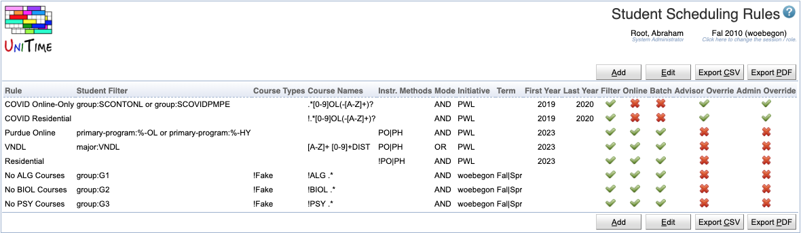

## Screen Description

 The Student Scheduling Rules page can be used to define special rules for student scheduling, both during batch and online. Using these rules, particular students can be restricted to only particular courses and/or to course configurations of specific instructional methods.

{:class='screenshot'}

## Examples

 During COVID, online-only students (not present on campus) were only allowed to attend special (Online-Only) courses identified by an online suffix, such as ENGL 106OL or COM 114OL-X. On the other hand, residential students (students present on campus) were allowed to request all courses except for these special Online-Only courses.

 Similarly, students of programs ending with -OL (Online) or -HY (Hybrid) may only attend course configurations of PO or PH instructional methods. So do the students of a couple of VNDL programs, except VNDL students may also take any course with a DIST suffix (such as ENGL 106DIST). All other students can be enrolled in course configurations of all the other remaining instructional methods.

## Student Scheduling Rules

 There can be many rules defined. The rules are processed in the provided order (the order can be changed using the Edit screen and the up and down arrows).  The first matching rule is used. If there are no rules, or if no rule is matching for a particular student, no course name or instructional method restrictions take place.

 Each rule has a name (**Rule**) and identifies a set of students by the provided filter (**Student Filter**). This filter has the same format as the filter on the [Online Student Scheduling Dashboard](online-student-scheduling-dashboard) page. Students can be, for example, identified by their curriculum information (academic area, major, classification, minor, concentrations, program, or campus), accommodation, or a student group or groups. Please take a look at the [Scheduling Dashboard Filter](scheduling-dashboard-filter) for more details.

 Each rule can be restricted by the academic  **Initiative** (e.g., a campus) or the academic **Term** (e.g., Fall or Spring). Both fields may contain a regular expression, e.g., use Spring|Fall for any academic term matching either Spring or Fall. In addition to the academic initiative and term, a rule can also be restricted by the academic year. It may contain the **First Year** and/or the **Last Year** for which the rule applies.

 Each rule may restrict the students to courses with a particular name (**Course Names** field), course type (**Course Types** field), or course configurations with a specific instructional method (**Instr. Methods** field). All these fields may contain a regular expression that the course name (subject area abbreviation followed by the course number), course type (reference), or instructional method reference must match, respectively. The regular expression can be negated by being prefixed with an exclamation mark (e.g., all courses with names that do not match the provided regular expression).

 If a rule contains two or more regular expressions (e.g., Course Name and Instructional Methods), it is possible to set the rule's mode to either match all these expressions (**Mode** field set to **AND**) or just one of them (Mode field set to **OR**). So, for example, a course must match both Course Names and Course Types when AND mode is used, or a course must match the Course Names or the Course Types when OR mode is used.

 There are three places where the rules are used, and each rule may only apply to some of these:

	1. In the [Course Finder](course-finder) (**Filter** toggle) that is used on the [Student Course Requests](student-course-requests), on the [Student Scheduling Assistant](student-scheduling-assistant), and on the [Advisor Course Recommendations](advisor-course-recommendations) pages. So, when this rule is used, a student may not be allowed to request a particular course (not matching the first applicable rule), but he/she may be able to enroll in such a course if the course has been added to them by an admin or an advisor. **Note:** if a filter is for instructional method(s), only courses that have a matching course configuration will show for the student, and if a course has multiple, the student will only see (and be able to put a preference on) instructional methods and classes of matching course configurations.
	2. During the online student scheduling (**Online** filter). When the [Student Scheduling Assistant](student-scheduling-assistant) page is used, only valid enrollments in the new courses will be available when the Build Schedule (or + New Course) buttons are used. This means that students will be only scheduled (and be able to move around) in the course configurations that match their rule. The only exception is when the student is already enrolled in the course (e.g., by an admin when allowed). In such a case, the student can drop the course but cannot make other changes to the enrollment of the course other than moving to some other course configuration that they are allowed to take (if a course only has a non-matching course configuration or does not match the course name, the student can only keep the course or drop it, but cannot move to some other section(s) of the course). 
	3. During the batch scheduling (**Batch** filter). When the students are scheduled using the [Student Scheduling Solver](student-scheduling-solver) page, the students can only be placed in courses and course configurations that match their rule. There are no exceptions; the advisor and admin overrides do not apply to this mode.

 The rule may not apply when the course is being looked at or when the [Student Scheduling Assistant](student-scheduling-assistant) page is used by an advisor or an administrator on behalf of the student. These cases are indicated by the **Advisor Override** and the **Admin Override** toggles, respectively. So, for example, when the Advisor Override is checked, the advisor can put any course onto the [Advisor Course Recommendations](advisor-course-recommendations) page for the student, and the student will be able to pull it into their course requests.

## Operations

 A particular student scheduling rule can be changed by clicking the appropriate line. A new rule can be added at the bottom of the list using the **Add** button. All rules can be edited (including their order, or adding new rules) at once by clicking the **Edit** button.
