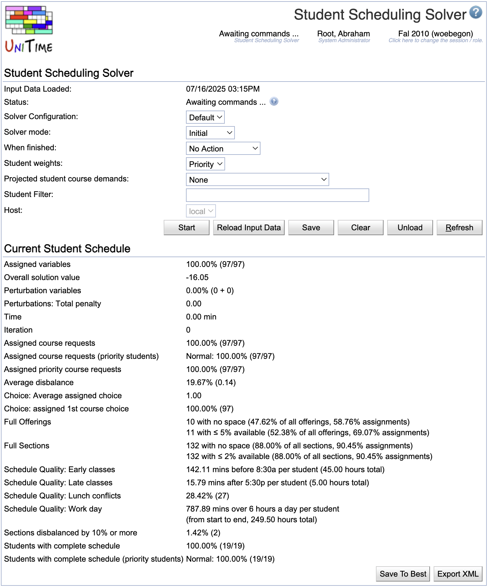

## Screen Description

In the Student Scheduling Solver screen, the user can run the sectioning solver to assign classes to students whose course requests have been entered into the system. The assignment is based on the timetable, the student requests, and, if needed, on the last-like or curriculum course demands (in case only a part of the current student course requests are available).

{:class='screenshot'}

The main input data for the solver, besides the course timetable, are the student course requests. These can be either imported using the [XML format](https://www.unitime.org/interface/woebegonStudents.xml) or entered by individual students using the [Student Course Requests](student-course-requests) page.

## Solver not started

### Solver

* **Status**
    * Current status of the solver

* **Solver configuration**
    * Configuration - see [Solver Configurations](solver-configurations) for more information
    * Choose the appropriate configuration from the choices listed

* **Solver mode**
    * Options
        * Initial - starts scheduling students with no previous assignments
        * MPP - continues working on the loaded schedule, trying to find a better schedule for the students with as few differences from the loaded one as possible
        * Projection - the real student enrollments are complemented with projected student course demands (the options for which demands are in the "Projected student course demands" drop-down list);

* **When finished**
    * Choose what to do when the time-out limit on the solver is reached

* **Student weights**
    * Options
        * Priority - priorities entered by students in their course requests are considered
        * Equal - no priorities considered, all requests have equal weight
        * Legacy - deprecated (used in previous versions of UniTime)
    * See Notes at the end of this page for more details about the options Priority and Equal

* **Projected student course demands**
    * Select the type of student course requests that should be used when not all real student enrollments are available
    * Options
        * None
        * Last Like Student Course Demands
        * Projected Student Course Demands
        * Curricula Course Demands
        * Curricula Last Like Course Demands
        * Student Course Requests
        * Enrolled Student Course Demands

* **Host** (admin)
    * Select the server you want to run the solver on (setting "auto" means that the least occupied solver will be used; this is the default behavior for non-administrator users)

### Operations

* **Load**
    * Load all input data necessary for student sectioning

* **Start**
    * Load all necessary data and start student sectioning

* **Refresh**
    * Refresh this screen

## Loading input data

During the loading phase, input data is loaded.

### Solver

* **Input data loaded**
    * Time stamp from the time when the latest load of input data started

For the rest, see above.

### Current Student Schedule

The Current Student Schedule is empty during the loading phase.

### Operations

* **Stop**
    * Stop the loading of the solver.
    * This will interrupt the loading process, and it will stop with an error. The solver will need to be unloaded afterward, as it will remain in a state where only some of the data has been loaded.

* **Refresh**
    * Refresh this screen
    * When loading is done, new buttons will appear

## Awaiting commands

### Current Student Schedule

The Current Student Schedule has been loaded into the solver together with the input data. The section for the Current Student Schedule has one operation: Store To Best - store the current student schedule to the Best Student Schedule Found So Far.

### Operations

* **Start**
    * Start the solver, which will section students

* **Reload Input Data**
    * Reload input data while keeping the current student schedule
    * The assignments that are no longer valid due to the change in the input data will be unassigned

* **Save**
    * Save the Best Student Schedule Found So Far

* **Clear**
    * Clear the student-class assignments

* **Unload**
    * Unload all data and the student schedule from the solver

* **Refresh**
    * Refresh this screen

## Solving problem

### Solver

See above

### Operations

* **Stop**
    * Stop the solver

* **Refresh**
    * Refresh this screen

## Solver stopped

### Best Student Schedule Found So Far

During the automated scheduling (when the solver is running), the best student schedule found so far is saved here. It is the schedule that is presented to the user when they stop the solver or when the time-out is reached.

When the user interacts and makes changes, they can save the intermediate results as "Best Student Schedule Found So Far" and later return to this schedule if the current one is not satisfactory.

### Current Student Schedule

When the solver is stopped, the Best Student Schedule Found So Far is the same as the Current Student Schedule. If the solver is running, you can see the current solution it is working with in this section.

The **Assigned variables** percentage shows how many of these variables are assigned (it is the number of assigned variables divided by the number of all variables in the problem).

The **Assigned course requests** percentage ignores free times and, as a base for the percentage, it only counts variables that are not substitutes (i.e., that are not listed in the Substitute Course Requests table on the [Student Course Requests](student-course-requests) page).

The **Students with complete schedule** percentage is less precise as it only counts whole students. It is the number of all students that have a complete schedule divided by the number of students in the problem. A student has a complete schedule when they have the desired number of courses assigned.

There are other properties. There are **distance conflicts** and **time overlaps** (where time overlaps are allowed, e.g., when the *Allow Student Overlaps* is checked on the scheduling subpart). The **Selection** shows how well the section and instructional method preferences met. The **using classes w/o time** shows the number of enrollments that have Arranged Hours classes (the percentage corresponds to the number of student class enrollments that have no time, divided by the number of all student class enrollments). There are also parameters measuring section balancing.

Additional student **Schedule Quality** criteria that consider individual student schedules. The parameters can be adjusted in the solver configuration.
* **Lunch Break**: (allow time for lunch): there is a lunch conflict created when the student has two classes on a day that overlap with the lunch period of 11 am - 1 pm, with less than 30 minutes in between
* **Travel Time**: there is a conflict proportional to the travel time (in minutes) between two classes on the same day that are less than 1 hour apart (or less than 2 hours apart when the travel time is longer than the break time of the first class -- 10 minutes for most classes)
* **Back-to-Back**: there is a (negatively weighted) conflict for any two classes that are back-to-back and on the same day (the idea is to minimize gaps, so we want more classes clustered together)
* **Workday**: there is a conflict when the student has two classes that have more than six hours between the start of the first one and the end of the second one; the conflict is proportional to the number of hours over this limit (e.g., if the two classes span 8 hours, the penalty is 2) -- again the idea is to make the schedule more compact, without unnecessary gaps
* **Too Early**: there is a conflict when the class starts before 8:30 am (proportional to the time of the class before 8:30)
* **Too Late**: there is a conflict when the class ends after 5:30 pm (proportional to the time of the class after 5:30)

Additional criteria concerning student accommodations can be created. These can be registered using the [Create Student Accommodations Solver Configuration Parameters.xml](https://raw.githubusercontent.com/UniTime/unitime/refs/heads/master/Documentation/Scripts/Create%20Student%20Accommodations%20Solver%20Configuration%20Parameters.xml) script: Import the XML page using the [Data Exchange](data-exchange) page and then run the Student Scheduling: Student Accommodations Solver Configuration Parameters script using the [Scripts](scripts) page. There are the following criteria:
* **Short Distances**: there is a short distance conflict for all students of the SD accommodation when two consecutive classes with non-zero travel time
* **Bree Time**: higher penalization for time conflict between a class and a free time request for students with FT accommodation
* **Back-to-Back**: a back-to-back conflict (for students with BTB accommodation) occurs every time a student has two consecutive classes that are more than 30 minutes apart
* **Break Between Classes**: a no-break-between-classes conflict (for students with BBC accommodation) occurs every time a student has two consecutive classes that are less than 30 minutes apart

### Operations

* **Restore From Best**
    * Discard the current student schedule and start again from the best student schedule found so far

* **Store To Best**
    * Overwrite the Best Student Schedule Found So Far with this current student schedule

### Problems

The list of warnings appears if any problems occurred during the data load. If there is a problem while solving, there will be an error message (such as Error: FATAL).

### Operations

* **Start**
    * Restart the solver from the current student schedule

* **Reload Input Data**
    * Reload the data from the Input Data section without losing the assignments in the current student schedule; only prohibited assignments will be lost if breaking hard constraints is not allowed

* **Save**
    * Save the best student schedule found so far
    * Student class enrollments are saved for real students; projected demands are used to update class expected demands for online student scheduling

* **Clear**
    * Clear student-class assignments

* **Unload**
    * Unload both the input data and the student schedule from memory (any student schedule will be lost unless saved in the Best Student Schedule Found So Far section)

* **Refresh**
    * Refresh this screen

## Notes

Description of the student weights:

**Priority student weighting model**

* First priority request has better weight than all the rest
* Total weight for a student should be between zero and one, one for a fully satisfied student
* Request weight: 1st priority 0.501, 2nd priority 0.250, 3rd priority 0.1248, 4th priority 0.0623, ... (1/2 for alternatives, e.g., 0.2505 for the first alternative of a course)
* 1/2 and 1/4 for the alternatives; but the difference will be distributed down-wards (student has more weight to get the n+1, n+2, ... priority courses)
* Weights are rounded to four digits
* The rest to 1 -- put to the last request or split evenly between all of them.

**Alternative (equal) weighting model**

* All course (non alternative) requests have equal weight (priority is ignored)
* First alternatives have lower weight than first choices, but equal among themselves
* Second alternatives have lower weight than first alternatives, alternative course requests than second alternatives

**There are three ways to use student sectioning**

* When all students are preregistered, the projected demand is none
* If only some students are preregistered, loading and solving preregistered and projected demands together allows students use of online scheduling
* Projection mode is used to recalcule the projected demands
