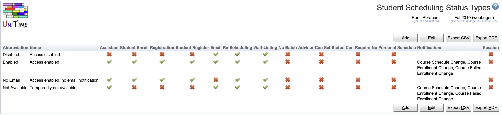
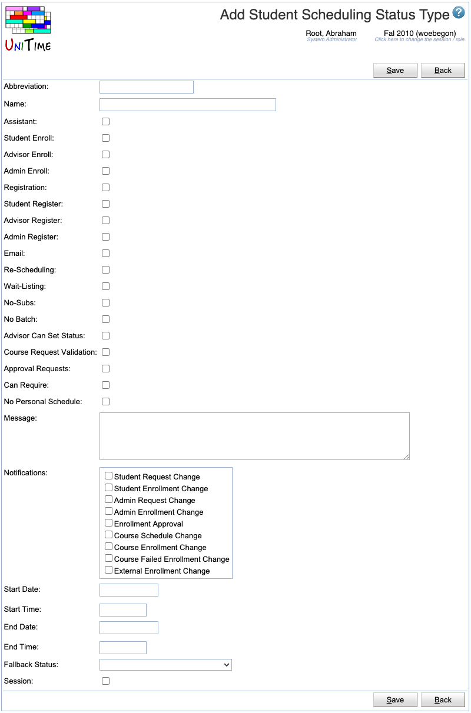
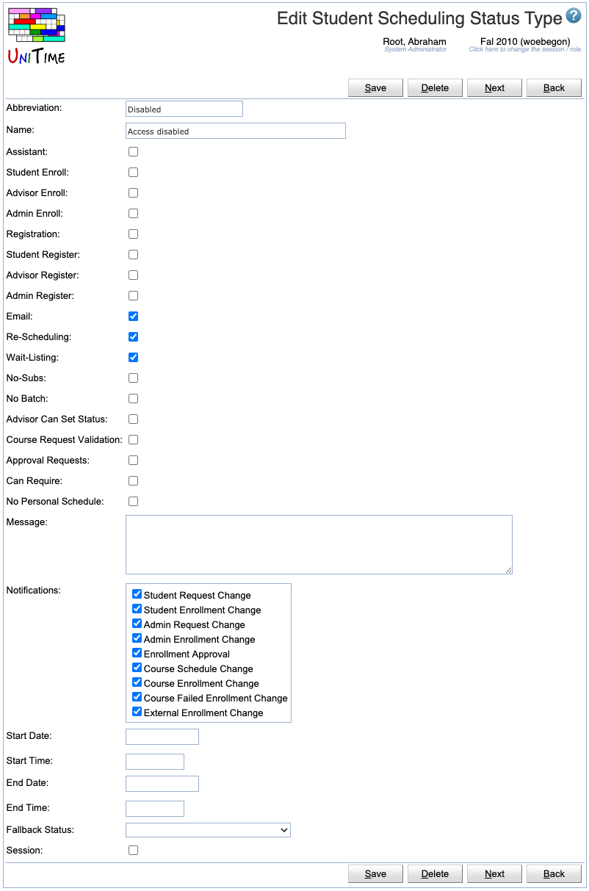
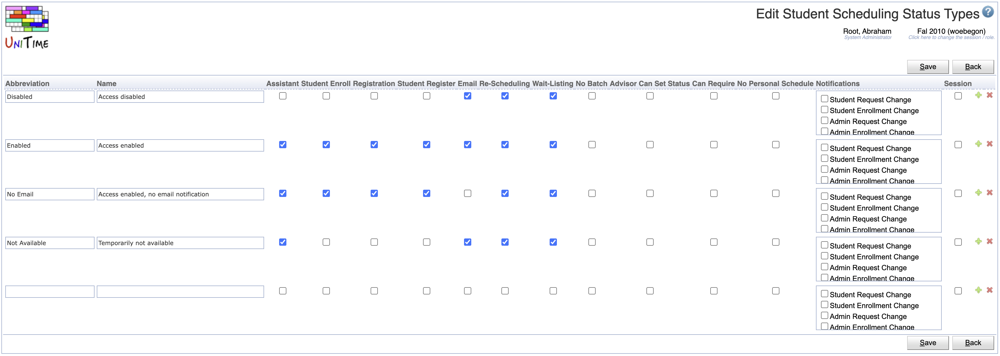

## Screen Description

The Student Scheduling Status Types screen provides a table of possible statuses for students during online scheduling. A default student scheduling status can be set on the academic session ([Edit Academic Session](edit-academic-session) page) and overridden on a particular student ([Online Student Scheduling Dashboard](online-student-scheduling-dashboard) page, e.g., using the [Set Status](set-status-for-student) dialog).

{:class='screenshot'}

## Details

The table of statuses has the following columns

* **Abbreviation**
	* Abbreviation of the scheduling status (as displayed e.g. in the Students table in the [Online Student Scheduling Dashboard](online-student-scheduling-dashboard) screen)

* **Name**
	* Name of the scheduling status

#### Scheduling Assistant Permissions

* **Assistant**
	* Indicates whether the student has access to the [Student Scheduling Assistant](student-scheduling-assistant) page
	* This also indicates whether student advisors and other administrative users can access the [Student Scheduling Assistant](student-scheduling-assistant) page on behalf of the student

* **Student Enroll**
	* Indicates whether the student can use the Enroll button (a student can have access to online scheduling assistant without the ability to make changes)

* **Advisor Enroll**
	* Indicates whether the student advisor (Student Scheduling Advisor permission) has access to online scheduling (can make changes on behalf of a student)

* **Admin Enroll**
	* Indicates whether the scheduling administrator (Student Scheduling Admin permission) has access to online scheduling (can make changes on behalf of a student)

#### Course Requests Permissions

* **Registration**
	* Indicates whether the student has access to the [Student Course Requests](student-course-requests) page
	* This also indicates whether student advisors and other administrative users can access the [Student Course Requests](student-course-requests) page on behalf of the student

* **Student Register**
	* Indicates whether the student can use the Save button (a student can have access to course requests without the ability to make changes)

* **Advisor Register**
	* Indicates whether the student advisor (Student Scheduling Advisor permission) has access to course requests (and can make changes on behalf of a student)

* **Admin Enroll**
	* Indicates whether the scheduling administrator (Student Scheduling Admin permission) has access to course requests (and can make changes on behalf of a student)

#### Notifications

* **Email**
	* Indicates whether the student should be able to receive automatically generated notification emails

* **Notidications**
	* Indicates which of the automatically generated notification emails the student can receive
	* **Student Request Change** Student made a change on the [Student Course Requests](student-course-requests) page
	* **Student Enrollment Change** Student made a schedule change on the [Student Scheduling Assistant](student-scheduling-assistant) page
	* **Admin Request Change** Admin or advisor made a change on the [Student Course Requests](student-course-requests) page
	* **Admin Enrollment Change** Admin or advisor made a schedule change on the [Student Scheduling Assistant](student-scheduling-assistant) page
	* **Enrollment Approval** Consent has been approved or denied
	* **Course Schedule Change** A class that the student has enrolled has been moved to a different time and/or room
	* **Course Enrollment Change** There has been a change in the student schedule due to wait-listing or re-scheduling (e.g., student was moved from a cancelled class)
	* **Course Failed Enrollment Change** An automatic enrollment change has failed (when an external enrollment provider is used)
	* **External Enrollment Change** Student schedule has been changed externally (outside the UniTime user interface)

#### Other

* **Re-Scheduling**
	* Indicate whether re-scheduling is available for the student
* **Wait-Listing**
	* Indicate whether wait-listing is available for the student
* **No-Subs**
	* The student can indicate that the course cannot have any substitutes (when there are courses listed in the Substitute Course Requests table)
	* Typically, either Course Wait-List or Allow No-Subs are used, but not both at the same time
* **No Batch**
	* When checked, student class enrollments cannot be changed during batch student scheduling ([Student Sectioning Solver](student-scheduling-solver) screen). These students, however, do count against the class / configuration / course / reservation limits.

* **Advisor Can Set Status**
	* Student advisors can use the [Online Student Scheduling Dashboard](online-student-scheduling-dashboard) to change student status to this status (must have Student Scheduling Change Student Status permission)

* **Course Request Validation**
	* Use the custom course request validation when configured. Custom course request validation can be used to provide additional validation for the entered course requests, to request overrides, and/or to check student eligibility to register.

* **Approval Requests**
	* Use the custom special registration when configured. Custom special registration can be used to provide the Scheduling Assistant with the ability to request registration overrides (e.g., during late registration).

* **Message**
	* Message to be displayed when the student tries to enroll

* **Course Types**
	* Only available when there are course types defined ([Course Types](course-types) screen)
	* It is possible to define which courses a student can request in the [Online Student Scheduling Dashboard](online-student-scheduling-dashboard)
	* In this case, there is a toggle for each of the course types defined
	* There is also a toggle (named **Other (No Type)**) that applies to all course offerings that do not have a course type set

* **Start Date, Start Time, End Date, End Time**
	* An effective period (time window) can be defined for the status. Students are not allowed to make any changes outside of the effective period (unless allowed by the fallback status).
	* The effective period starts (or ends) at midnight when the start time (or end time) is not defined.

* **Fallback Status**
	* Fallback status when outside of the effective period. The fallback status can also have an effective period defined and its own fallback status.

* **Session**
	* If checked, this student status will only be available in the current academic session
	* This is particularly useful for the statuses with start/end dates

## Operations

The table can be sorted by any of its columns, just by clicking on the column header and the sorting option that opens. It is also possible to hide/show some columns.

### Add Student Scheduling Status Type
Click **Add** to add a new student scheduling status type

{:class='screenshot'}

* Click **Save** to create a new student scheduling status type
* Click **Back** to return to the list without making any changes

### Edit Student Scheduling Status Type
Click a particular student scheduling status type to make changes or to delete the student scheduling status type

{:class='screenshot'}

* Click **Save** to make changes, **Back** to return to the list without making any changes
* Click **Previous** or **Next** to save the changes and go to the previous or next student scheduling status type respectively
* Click **Delete** to delete the student scheduling status type

### Edit Student Scheduling Status Types
Click **Edit** to edit all student scheduling status types

{:class='screenshot'}

* Use the  icon to add a new line and  to delete a line
* Click **Save** to make changes, **Back** to return to the list without making any changes

### Export CSV/PDF
Click the **Export CSV** or **Export PDF** to export the list of student scheduling status types to a CSV or PDF document respectively