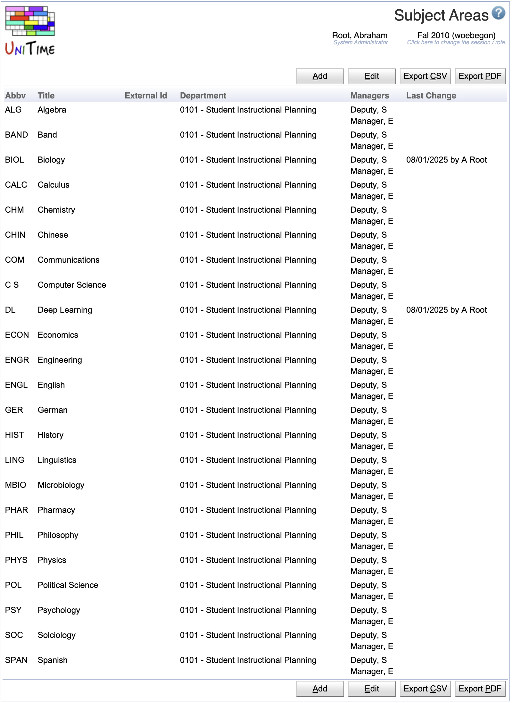

## Screen Description

 The Subject Areas screen lists all subject areas for a given academic session with some basic information about them.

## Details

 The top line shows the academic session for which the subject areas are listed. The list contains the following columns (and can be sorted by any of them by clicking on the column heading)

* **Abbv**
	* Abbreviation of the subject area

* **Title**
	* Title of the subject area

* **External ID**
	* External ID of the subject area (optional)

* **Department**
	* Department to which the subject area belongs (required)

* **Funding Department**
	* The department funding the classes for this subject area if they are funded by a department other than the department to which the subject area belongs.
		* This column is not visible by default.  To enable this column the unitime.courses.funding_departments_enabled application property must be set to true.

* **Managers**
	* A list of managers associated with the department

* **Last Change**
	* Date and time of the last change made to the input data of that subject area

 Click on any subject area to edit it in the [Edit Subject Area](edit-subject-area) screen.

## Operations

* **Add Subject Area**
	* Add a new subject area in the [Add Subject Area](add-subject-area) screen

* **Edit Subject Area**
	* Edit all subject areas on the [Edit Subject Areas](edit-subject-areas) screen

* **Export PDF**
	* Export the list of subject areas to a PDF document

{:class='screenshot'}
