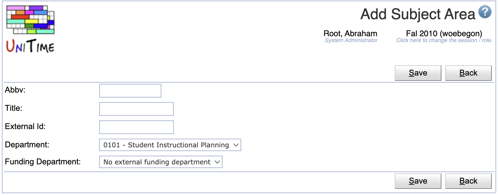
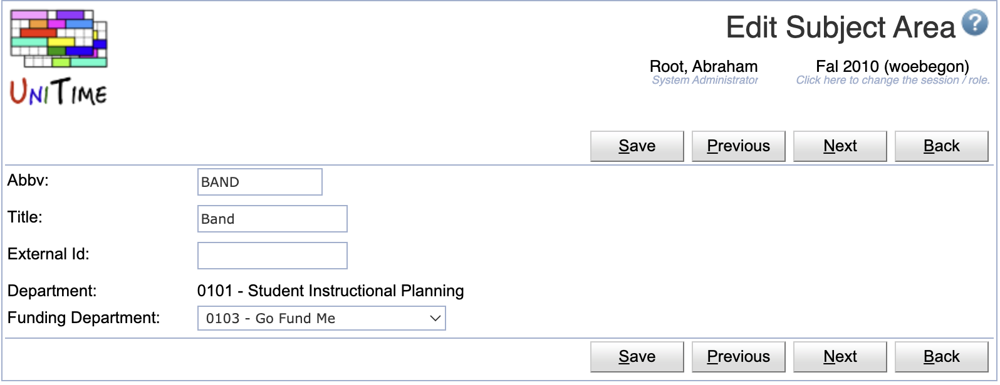
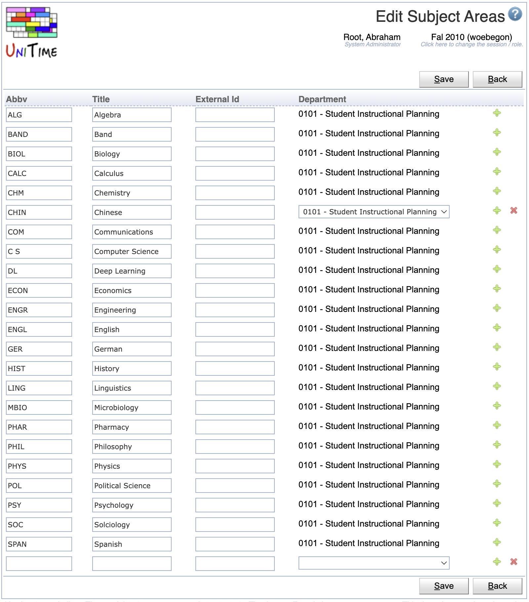

## Screen Description

The Subject Areas screen displays and allows editing of the list of available subject areas for the current academic session.

{:class='screenshot'}

## Properties

Each subject area contains the following properties:

* **Abbv**
	* Abbreviation of the subject area

* **Title**
	* Title of the subject area

* **External Id**
	* External ID of the subject area (optional)

* **Department**
	* Department to which the subject area belongs (required)
	* Can be only changed if there is a committed timetable for the current department of this subject area
	* A new department can be added from the [Departments](departments) screen

* **Funding Department**
	* The department funding the classes for this subject area if they are funded by a department other than the department to which the subject area belongs.
		* Only a department marked as Funding Department on the [Departments](deparments) screen area available.
		* The default option is the *No external funding department*, which means there is no external funding department for the courses of this subject area.
	* This column is not visible by default.  To enable this column, the `unitime.courses.funding_departments_enabled` application property must be set to true in the [Application Configuration](application-configuration)

* **Managers**
	* A list of managers associated with the department
	* Not editable on this page (see [Timetable Managers](timetable-managers) screen)

* **Last Change**
	* Date and time of the last change made to the input data of that subject area
	* Not editable on this page (see [Last Changes](last-changes) screen)

Click on any subject area to edit it in the [Edit Subject Area](edit-subject-area) screen.

## Operations

### Add Subject Area
Click **Add** to add a new subject area

{:class='screenshot'}

* Click **Save** to create a new subject area
* Click **Back** to return to the list without making any changes

### Edit Subject Area
Click a particular subject area to make changes or to delete the subject area

{:class='screenshot'}

* Click **Save** to make changes, **Back** to return to the list without making any changes
* Click **Previous** or **Next** to save the changes and go to the previous or next subject area respectively
* Click **Delete** to delete a subject area. Subject areas with a committed timetable cannot be deleted.

### Edit Subject Areas
Click **Edit** to edit all subject areas

{:class='screenshot'}

* Use the  icon to add a new line and  to delete a line
* Subject areas with a committed timetable cannot be deleted
* Click **Save** to make changes, **Back** to return to the list without making any changes

### Export CSV/PDF
Click the **Export CSV** or **Export PDF** to export the list of subject areas to a CSV or PDF document respectively
