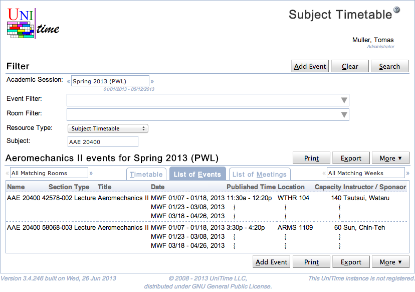
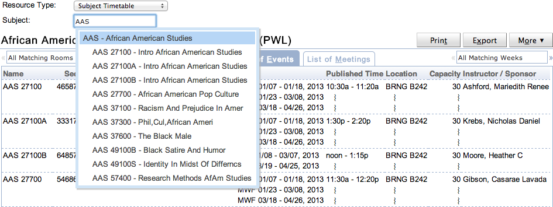

## Screen Description

Subject Timetable page is a variant of the [Events](events) page that allows to see a timetable of a particular subject area or one of its courses.

{:class='screenshot'}

When the Resource Type it changed to Subject Timetable, one can see all class, examination, and course related events that are related to a particular subject area or a course offering. The subject area or course can be entered in the Subject field.

{:class='screenshot'}

Besides of the ability to filter events and rooms (see description of the [Event Filter](events-event-filter) and [Room Filter](events-room-filter)), the page allows to select a particular **resource type**. The following options can be selected:

* [Room Timetable](room-timetable) (all events of a particular room)

* [Subject Timetable](subject-timetable) (all class, examination, and course related events of a subject area or a course offering)

* [Curriculum Timetable](curriculum-timetable) (all class, examination, and course related events of a curriculum)

* [Departmental Timetable](departmental-timetable) (all class, examination, and course related events of a department)

* [Personal Timetable](personal-timetable) (all events of a person)
