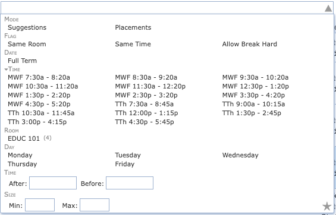

## Screen Description

The Suggestions screen provides you with information about a class, its current time and room assignment, and possible alternatives. You can select any of the alternatives to change the assignment. If the selected assignment results in an unassignment of another class, you can continue by selecting an alternative assignment for the other class (for example, you place your current Lab 2 in a room at a time when there was Lab 1 and therefore Lab 1 gets unassigned; you continue by selecting an alternative assignment for Lab 1). The screen supports a "what if" scenario - you can select as many changes as you want, and those changes will not be executed until you click the Assign button.

{:class='screenshot'}

## Current Assignment

Information about the current time and room assignment for a given class. If an item is not applicable for the selected class, it is not displayed (for example, the Instructor line is not displayed if there is no instructor assigned to teach this class).

* **Date**
    * Date pattern for the class

* **Time**
    * Time currently assigned to this class (includes days and time)
    * Can be changed in this screen

* **Room**
    * Room(s) currently assigned to this class
    * Can be changed in this screen

* **Instructor**
    * The instructor assigned to teach this class who requires conflict checking for this class (this assignment has to be done in the Input Data section before data is loaded into the solver)

* **Student Conflicts**
    * Number of student conflicts with other classes

* **Violated Constraints**
    * Listing of any distribution and back-to-back instructor preferences violated by this assignment

* **Available Rooms**
    * Possible room placements for the class - rooms that are large enough to seat all the students from the class
    * Prohibited room selections are displayed in red. Rooms that are too small are displayed with a strike-through. These are only displayed and selectable in interactive mode.

* **Available Times**
    * Possible time placements for the class - times within selected time patterns that are not prohibited
    * Prohibited time selections within allowed time patterns are displayed in red. Times from disallowed patterns are displayed with a strike-through. These are only displayed and selectable in interactive mode (i.e., a solution was loaded into the solver using [Timetables](timetables) page, or using [Solver](solver) page with Allow breaking of hard constraints toggle switched on).

* **Minimal Room Size**
    * Size of the smallest room that can be used for this class

Color coding is employed for the information about times and rooms - see the legend under the Current Assignment section in the Suggestions screen.

## Selected/Conflicting Assignments

Information about the change you are about to make. If there are conflicting assignments, they are listed in the Conflicting Assignments section, together with the constraint that causes the conflict, such as room, instructor, or a distribution preference. You can click on the conflicting class and find a new time/room assignment for it, which will then become a part of the selected assignment.

* If you want to make the change, click the **Assign** button
* If not, click on the  icon on the line with the class in the selected assignment to undo the selected assignment
* Or exit the Suggestions screen (Escape button or the x icon in the top right corner of the Suggestions dialog)

{:class='screenshot'}

## Conflicts

This table lists possible times with the student conflicts and violated distribution preferences that will occur if the time is selected for the class. This information should help you decide what time to choose if you want to make a change in time.

{:class='screenshot'}

Click the three dots next to the number of Student Conflicts to see the details of those conflicts. Click the three dots next to the number in the column of Violated Distr. Constr. to see which constraint will be violated if the time on that line is selected.

## Suggestions

This section contains a list of possible changes to the time/room assignment for the class. The Score indicates how good/bad the change is for the timetable (the lower the number, the better). The table is by default sorted by Score, but any column can be sorted - just click on the column header.

Click on any of the suggestions to make it your selected suggestion, then click on the **Assign** button to make this change happen.

{:class='screenshot'}

* Use **Search Deeper** to increase the number of changes that the solver can make by one (defaults to two changes when the page is opened).
* Use **Search Longer** to double the time that the solver can spend computing suggestions (defaults to 5 seconds when the page is opened, only shown when the time limit is reached).

### Suggestions Filter

You can work with the Filter to look for suggestions that include only a specific date pattern, a specific time, or a specific room.

{:class='screenshot'}

* **Text filter**
    * Enter a substring by which you want to filter the possible placements of the selected class
    * Examples:
        * Enter a building abbreviation to find placements within a building
        * Enter M to find placements with a Monday time
        * Enter 8:30 to find possible placements that cause the class to begin at 8:30

* **Mode**
    * The default mode is suggestions.
    * When switched to Placements mode, the table displays all allowable placements for this class.
    * The difference between Suggestions and Placements is that Suggestions do not leave classes unassigned - the changes suggested there include alternative assignments for classes that would be left unassigned in Placements.

* **Flag**
    * For the purposes of finding an alternative time/room placement (assignment), you can select to display all possibilities (No Restriction), only possibilities that have the same time but a different room (Same Time) or only possibilities that have the same room but a different time (Same Room)
    * When used in the interactive mode, the *Allow Break Hard* option allows the solver to show suggestions or placements that use a prohibited time or room

* **Date**
    * Select one or more possible date patterns for the selected class. Only placements or suggestions using these date patterns for the selected will be listed.

* **Time**
    * Select one or more possible times for the selected class. Only placements or suggestions using these times for the selected will be listed.

* **Room**
    * Select one or more possible rooms for the selected class. Only placements or suggestions using these rooms for the selected will be listed.

* **Day**
    * Select days of the week for the selected class. Only placements or suggestions using these days of the week for the selected will be listed.

* **Start/End Time**
    * Select a time window for the selected class. Only placements or suggestions using matching times for the selected will be listed.

* **Size**
    * Enter the range of possible room sizes - only placements or suggestions that include a room of that size will be listed.

## Conflict Statistics

The conflict-based statistics are a record of the conflicts created during the solver's attempts to assign possible rooms and times to the class (i.e., other class assignments that were incompatible) and the reasons for these conflicts. These reasons correspond to violations of various constraints on the problem (for example, two classes requiring a single instructor at the same time, or three classes requiring the same time when only two rooms are available). Typically, these conflicts are caused by too many classes competing over a fixed resource. The statistics can help point out the constraining resource or an overly restrictive requirement, so that changes can be made to the input data that allow the problem to be solved.

Each line in the conflict-based statistics table contains a number indicating how many times a conflict occurred and the constraint that was in contention. Clicking on the small plus sign at the beginning of the line will provide an expanded breakdown of the conflicts for this constraint. Continue opening lines with large numbers of conflicts until you have a line with a small dot rather than a plus sign. These lines indicate the classes with which your unassigned class was competing over a constraint.

Conflict-based statistics are only displayed after the solver has been executed (they are not displayed if the timetable has only been loaded into the solver).

Usage: It is helpful to look at the conflict-based statistics for the classes that are in the [Not-Assigned Classes](not-assigned-classes) screen to find out about problems you can fix in the input data (so that the next time you run the solver, all classes get assigned).
