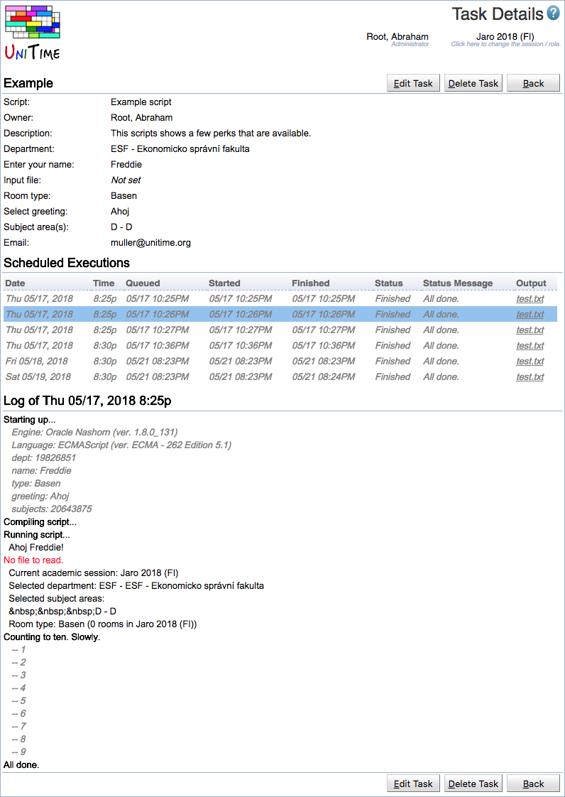
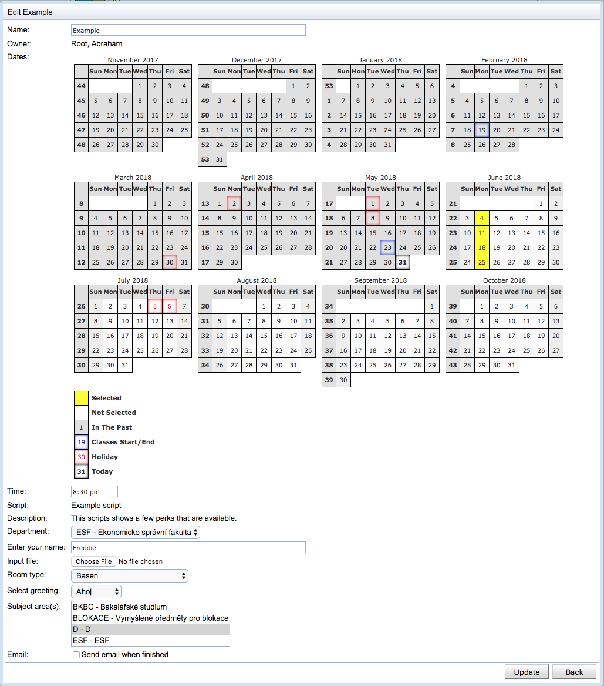

## Screen Description

The Task Details page can be used to show (and edit) details of a particular scheduled task. It also allows to show individual runs, their output files, and execution logs.

## Details

Each task has the following properties

* **Name**
	* Task name

* **Owner**
	* Administrative user who created the task

* **Script**
	* Script to be periodically executed

* **Parameters**
	* Script parameters (depending on the script)

* **Dates**
	* Dates when the script is to be executed

* **Time**
	* Start time

* **Status**

* **Created** ... a task execution has been created and is scheduled to be executed
	* **Queued** ... a task execution is queued for the execution (only one script can be running at a time)
	* **Running** ... a task execution is being executed
	* **Finished** ... a task execution has finished
	* **Failed** ... a task execution has failed

Individual executions are shown in the **Scheduled Executions** table. Besides of the date and time of the execution, the line contains the queued, started, and finished time stamps, execution status and the last status message, and the resultant file (when available).

* Click the execution line to see the log.

* Click the Output file to download the resultant file (only visible when at least one execution has produced a file)

{:class='screenshot'}

## Operations

* **Edit Task**
	* Show the Edit Task dialog to modify script parameters, execution days, and start time.

* **Delete Task**
	* Delete this task and go back to the [Task Scheduler](task-scheduler) page.

* **Back**
	* Go back to the [Task Scheduler](task-scheduler) page.

{:class='screenshot'}
