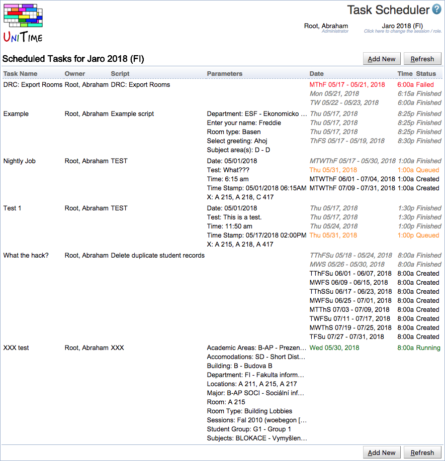

## Screen Description

The Task Scheduler page can be used to schedule periodic execution of the existing [Scripts](scripts) within the current academic session.

{:class='screenshot'}

## Details

Each task has the following properties

* **Name**
	* Task name

* **Owner**
	* Administrative user who created the task

* **Script**
	* Script to be periodically executed

* **Parameters**
	* Script parameters (depending on the script)

* **Dates**
	* Dates when the script is to be executed

* **Time**
	* Start time

* **Status**

* **Created** ... a task execution has been created and is scheduled to be executed
	* **Queued** ... a task execution is queued for the execution (only one script can be running at a time)
	* **Running** ... a task execution is being executed
	* **Finished** ... a task execution has finished
	* **Failed** ... a task execution has failed

More details can be seen when clicking on a task, including the log and output files for the executions that have already finished. This will show the [Task Details](task-details) page.

It is possible to roll scheduled tasks from one academic session to the next using the [Roll Forward Session](roll-forward-session) page. The dates are relative to the academic session start date.

{:class='screenshot'}

## Operations

* **Add New**
	* Create a new task. When clicked, an Add Task dialog is shown where a new task can be created.

* **Refresh**
	* Refresh the page

